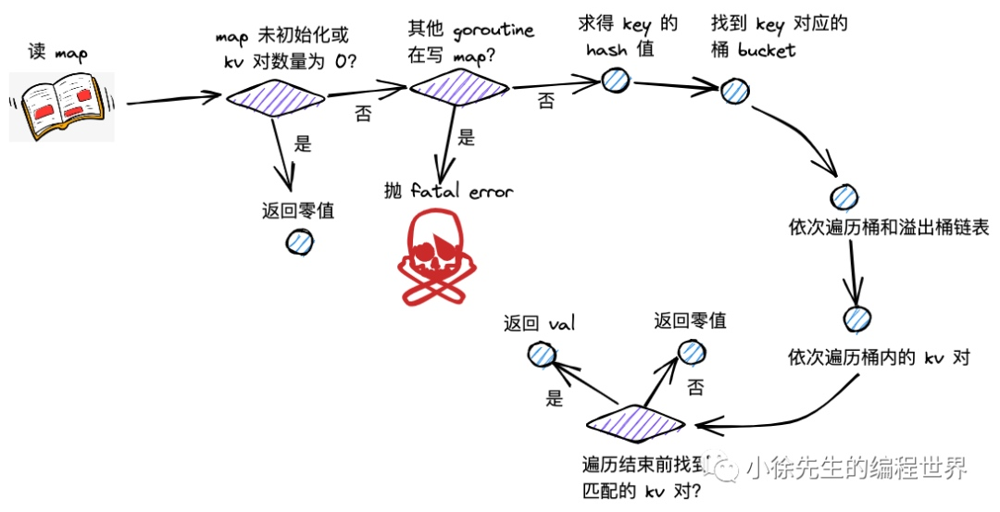

## map 底层实现原理

## 遍历 map 为什么是无序的？

map 触发等量扩容后, Go 会尽可能的利用每个 bucket 的空间, 将分散的和溢出 bucket 中的 key value 重新排列。所以无法保证顺序。

## map 为什么是非线程安全的？

为了更高效的读写 map

## map 如何保证线程安全？

- `sync.RWLock` 读 map 加 `RLock`, 写 map 加 `Lock`

- sync.Map 线程安全，读写分离

## map 解决冲突的方式？

- 拉链法: 将命中同一个桶的元素通过链表的形式进行链接
- 开放寻址法: 在插入新 key value 时，会基于一定的探测策略寻找一个可用的空闲单元

| 方法 | 优点 |
| :--- | :--- |
| 拉链法 | 简单，无需预先为元素分配内存 |
| 开放寻址法 | 无需额外的指针用于链接元素；内存地址完全连续，查找元素很快 |

## map 读流程

## map 写流程

## map 扩容流程

**增量扩容**

表现：扩容后，桶数组的长度增长为原长度的 2 倍；

目的：降低每个桶中 key-value 对的数量，优化 map 操作的时间复杂度.

**等量扩容**

表现：扩容后，桶数组的长度和之前保持一致；但是溢出桶的数量会下降.

目的：提高桶主体结构的数据填充率，减少溢出桶数量，避免发生内存泄漏.

## map 扩容负载因子为什么是 6.5?

跟 map 扩容、内存利用率有直接关系

## map 和 sync.Map 性能对比

`sync.Map` 支持并发读写，读访问 read map，写访问 dirty map。`sync.Map` 是一个读写分离的 map.

和原始 map + RWLock 的实现并发的方式相比，`sync.Map` 减少了加锁对性能的影响。`sync.Map` 会优先访问无锁 read map, 最后访问加锁的 dirty map 兜底。

**优缺点：**

`sync.Map` 适合读多写少的场景；写多的场景会导致 read map 缓存失效