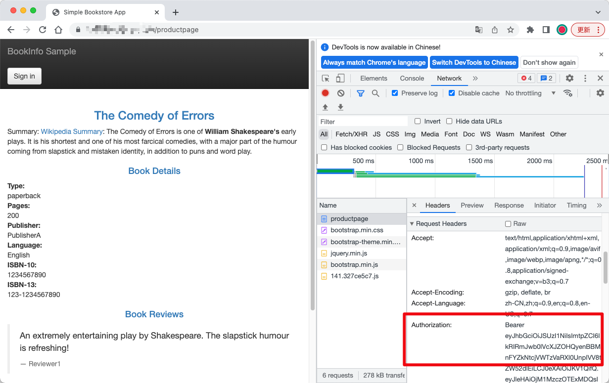
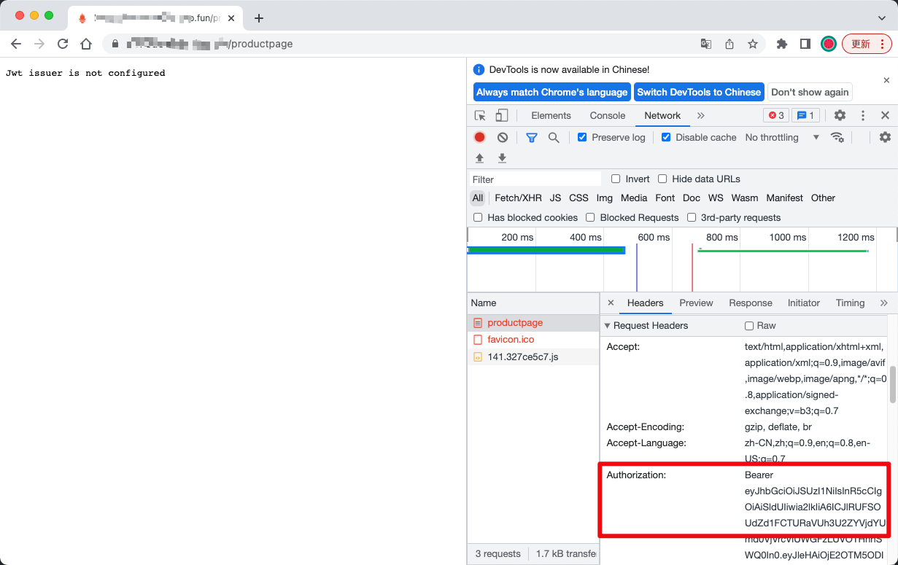
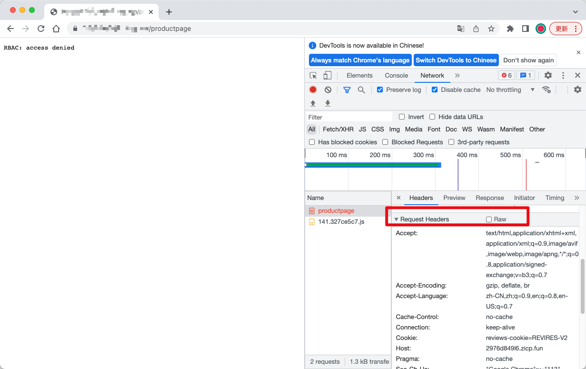

# 微服务添加 AuthN 认证策略（JWT）
 
> 前置条件：部署 [Bookinfo Application](https://istio.io/latest/docs/examples/bookinfo)

```bash
❯ kubectl get pod
NAME                             READY   STATUS    RESTARTS   AGE
details-v1-5ffd6b64f7-vzdhg      2/2     Running   0          6d19h
productpage-v1-8b588bf6d-2w86d   2/2     Running   0          6d19h
ratings-v1-5f9699cfdf-7dcxv      2/2     Running   0          6d19h
reviews-v1-569db879f5-7bszt      2/2     Running   0          6d19h
reviews-v2-65c4dc6fdc-6wn9q      2/2     Running   0          6d19h
reviews-v3-c9c4fb987-nd9rr       2/2     Running   0          6d19h
❯ kubectl get gateway
NAME               AGE
bookinfo-gateway   7d19h
❯ kubectl get virtualservice.networking.istio.io
NAME       GATEWAYS               HOSTS   AGE
bookinfo   ["bookinfo-gateway"]   ["*"]   7d19h
```

为 istio-ingressgateway 工作负载创建 jwt-example 请求身份验证策略。此 istio-ingressgateway 工作负载策略接受 testing@secure.istio.io 颁发的 JWT：

```yaml
apiVersion: security.istio.io/v1beta1
kind: RequestAuthentication
metadata:
  name: bookinfo
  namespace: istio-system
spec:
  selector:
    matchLabels:
      app: istio-ingressgateway
  jwtRules:
  - issuer: testing@secure.istio.io
    jwksUri: https://raw.githubusercontent.com/istio/istio/release-1.11/security/tools/jwt/samples/jwks.json
    forwardOriginalToken: true
```

为 istio-ingressgateway 工作负载创建 require-jwt 授权策略。该策略要求对 istio-ingressgateway 工作负载的所有请求都具有有效的 JWT，且 requestPrincipal 设置为 testing@secure.istio.io/testing@secure.istio.io 。 Istio 通过将 JWT 令牌的 iss 和 sub 与 / 分隔符组合来构造 requestPrincipal

```yaml
apiVersion: security.istio.io/v1beta1
kind: AuthorizationPolicy
metadata:
  name: bookinfo
  namespace: istio-system
spec:
  selector:
    matchLabels:
      app: istio-ingressgateway
  action: ALLOW
  rules:
  - from:
    - source:
        # 匹配请求中的 JWT Token 的 <issuer>/<subject> 字段组合。
        requestPrincipals: ["testing@secure.istio.io/testing@secure.istio.io"]
        # '*' 表示不校验 <issuer>/<subject> 组合。
        # requestPrincipals: ["*"]
  - to:
    - operation:
        # api 白名单
        paths:
        - /health/*
```

获取 JWT Token <https://raw.githubusercontent.com/istio/istio/release-1.11/security/tools/jwt/samples/groups-scope.jwt>

在 HTTP Header 中添加 Authorization 头，值为 Bearer JWT Token



错误的 JWT Token



未添加 JWT Token


