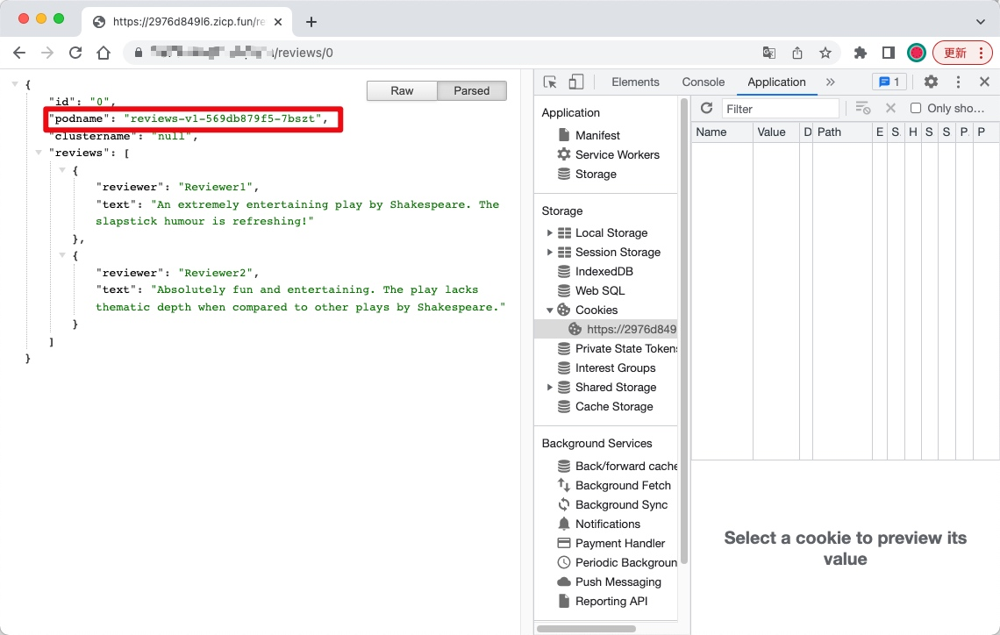
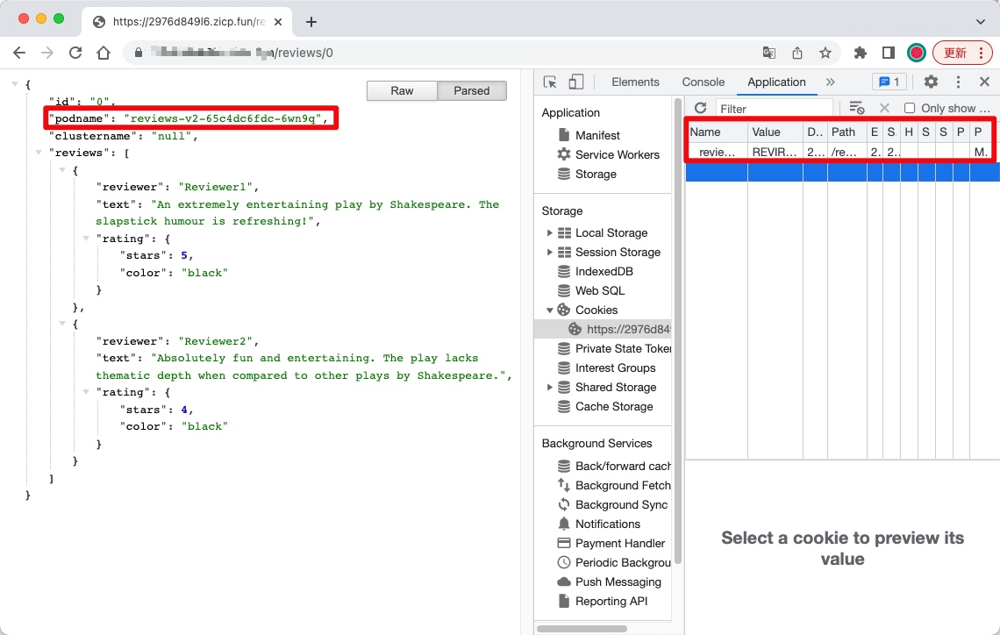

<!-- date: 2023-08-31 -->

# 具有会话亲和性的金丝雀部署

> 前置条件：部署 [Bookinfo Application](https://raw.githubusercontent.com/istio/istio/release-1.18/samples/bookinfo/platform/kube/bookinfo.yaml)

```bash
❯ kubectl apply -f https://raw.githubusercontent.com/istio/istio/release-1.18/samples/bookinfo/platform/kube/bookinfo.yaml
❯ kubectl get pod
NAME                             READY   STATUS    RESTARTS   AGE
details-v1-5ffd6b64f7-vzdhg      2/2     Running   0          6d19h
productpage-v1-8b588bf6d-2w86d   2/2     Running   0          6d19h
ratings-v1-5f9699cfdf-7dcxv      2/2     Running   0          6d19h
reviews-v1-569db879f5-7bszt      2/2     Running   0          6d19h
reviews-v2-65c4dc6fdc-6wn9q      2/2     Running   0          6d19h
reviews-v3-c9c4fb987-nd9rr       2/2     Running   0          6d19h
```

定义 reviews 服务的网关规则

```yaml
apiVersion: networking.istio.io/v1beta1
kind: Gateway
metadata:
  name: reviews-gateway
spec:
  selector:
    istio: ingressgateway
  servers:
  - hosts:
    - '*'
    port:
      name: http
      number: 8080
      protocol: HTTP
```

定义 reviews 服务的流量目标规则

```yaml
apiVersion: networking.istio.io/v1beta1
kind: DestinationRule
metadata:
  name: reviews
spec:
  host: reviews
  subsets:
  - labels:
      version: v1
    name: v1
  - labels:
      version: v2
    name: v2
  - labels:
      version: v3
    name: v3
```

reviews 服务 10% 的流量路由到 revires-v2，并且往客户端写入一些 Cookie；90% 的流量路由到 revires-v1 版本。

客户端一旦访问了金丝雀服务，会产生会话关联性，此后的所有后续请求将由 revires-v2 而不是 revires-v1 提供服务。

```yaml
apiVersion: networking.istio.io/v1beta1
kind: VirtualService
metadata:
  name: reviews
spec:
  hosts:
  - reviews
  http:
  - match:
    - headers:
        Cookie:
          regex: .*reviews-cookie.*REVIRES-V2.*
    route:
    - destination:
        host: reviews
        subset: v1
      weight: 0
    - destination:
        host: reviews
        subset: v2
      weight: 100
  - route:
    - destination:
        host: reviews
        subset: v1
      weight: 90
    - destination:
        host: reviews
        subset: v2
      weight: 10
      headers:
        response:
          add:
            Set-Cookie: reviews-cookie=REVIRES-V2; Max-Age=21600
```

逐渐扩大 reviews-v2 服务的权重，完成金丝雀部署

```yaml
apiVersion: networking.istio.io/v1beta1
kind: VirtualService
metadata:
  name: reviews
spec:
  hosts:
  - reviews
  http:
  - route:
    - destination:
        host: reviews
        subset: v1
      weight: 0 # [80, 60, 40, 20, 0]
    - destination:
        host: reviews
        subset: v2
      weight: 100 # [20, 40, 60, 80, 100]
      headers:
        response:
          add:
            Set-Cookie: reviews-cookie=REVIRES-V2; Max-Age=21600
```

所有请求路由到 reviews-v2 版本，完成金丝雀部署

```yaml
apiVersion: networking.istio.io/v1beta1
kind: VirtualService
metadata:
  name: reviews
spec:
  hosts:
  - reviews
  http:
  - match:
    - headers:
        Cookie:
          regex: .*reviews-cookie.*REVIRES-V2.*
    headers:
      response:
        add:
          Set-Cookie: reviews-cookie=REVIRES-V2; Max-Age=-1
    route:
    - destination:
        host: reviews
        subset: v1
      weight: 0
    - destination:
        host: reviews
        subset: v2
      weight: 100
  - route:
    - destination:
        host: reviews
        subset: v1
      weight: 0
    - destination:
        host: reviews
        subset: v2
      weight: 100
```

在浏览器中访问 `http://istio-ingressgateway.istio-system.svc.cluster.local` 并刷新它，直到看到 reviews-v2 正在处理的请求。会话亲和性的金丝雀部署，此后的所有后续请求将由 reviews-v2 而不是 reviews-v1 提供服务。



