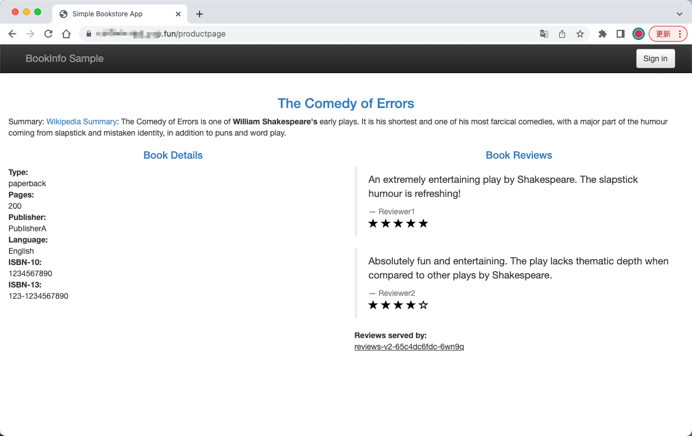
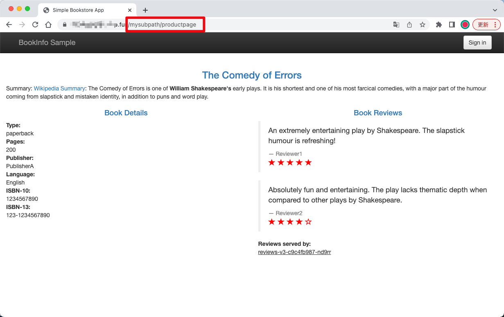

<!-- date: 2023-09-01 -->

# 使用 Envoyfilter 实现 subpath 功能

Istio 原生不支持 subpath，但是在某些场景下我们需要这个功能。原理很简单，可以通过 Envoyfilter 拦截七层流量，修改 headers 的 path 属性实现。

```yaml
apiVersion: networking.istio.io/v1alpha3
kind: VirtualService
metadata:
  name: subpath-productpage
  namespace: istio-system
spec:
  exportTo:
  - "*"
  hosts:
  - "*"
  gateways:
  - default/bookinfo-gateway
  http:
  - name: mysubpath
    match:
      - uri:
          exact: /mysubpath
      - uri:
          prefix: /mysubpath/
    route:
    - destination:
        host: productpage
---
apiVersion: networking.istio.io/v1alpha3
kind: EnvoyFilter
metadata:
  name: subpath-envoyfilter
  namespace: istio-system
spec:
  workloadSelector:
    labels:
      istio: ingressgateway
  configPatches:
    - applyTo: HTTP_ROUTE
      match:
        context: GATEWAY
        routeConfiguration:
          vhost:
            route:
              name: mysubpath
      patch:
        operation: MERGE
        value:
          name: envoy.lua
          typed_per_filter_config:
            envoy.filters.http.lua:
              '@type': type.googleapis.com/envoy.extensions.filters.http.lua.v3.LuaPerRoute
              source_code:
                inline_string: |-
                  function envoy_on_request(request_handle)
                    local path = request_handle:headers():get(":path")
                    local _, _, rest = string.find(path, "/[^/]+/(.*)")
                    if rest then
                      request_handle:headers():replace(":path", "/" .. rest)
                    end
                  end
```

部署 [Bookinfo Application](https://istio.io/latest/docs/examples/bookinfo/) 进行测试

```bash
❯ kubectl get pod
NAME                             READY   STATUS    RESTARTS   AGE
details-v1-5ffd6b64f7-vzdhg      2/2     Running   0          6d19h
productpage-v1-8b588bf6d-2w86d   2/2     Running   0          6d19h
ratings-v1-5f9699cfdf-7dcxv      2/2     Running   0          6d19h
reviews-v1-569db879f5-7bszt      2/2     Running   0          6d19h
reviews-v2-65c4dc6fdc-6wn9q      2/2     Running   0          6d19h
reviews-v3-c9c4fb987-nd9rr       2/2     Running   0          6d19h
❯ kubectl get gateway
NAME               AGE
bookinfo-gateway   7d19h
❯ kubectl get virtualservice.networking.istio.io
NAME       GATEWAYS               HOSTS   AGE
bookinfo   ["bookinfo-gateway"]   ["*"]   7d19h
❯ kubectl get envoyfilter -n istio-system
NAME                  AGE
subpath-envoyfilter   4m7s
```




