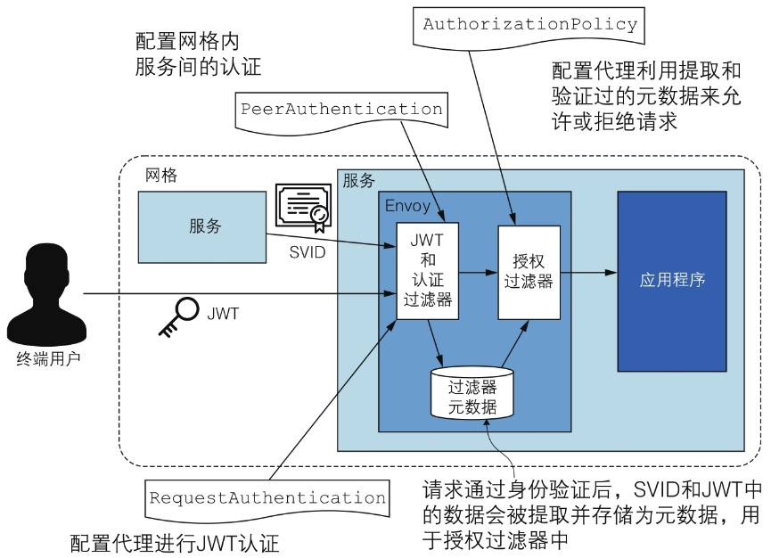
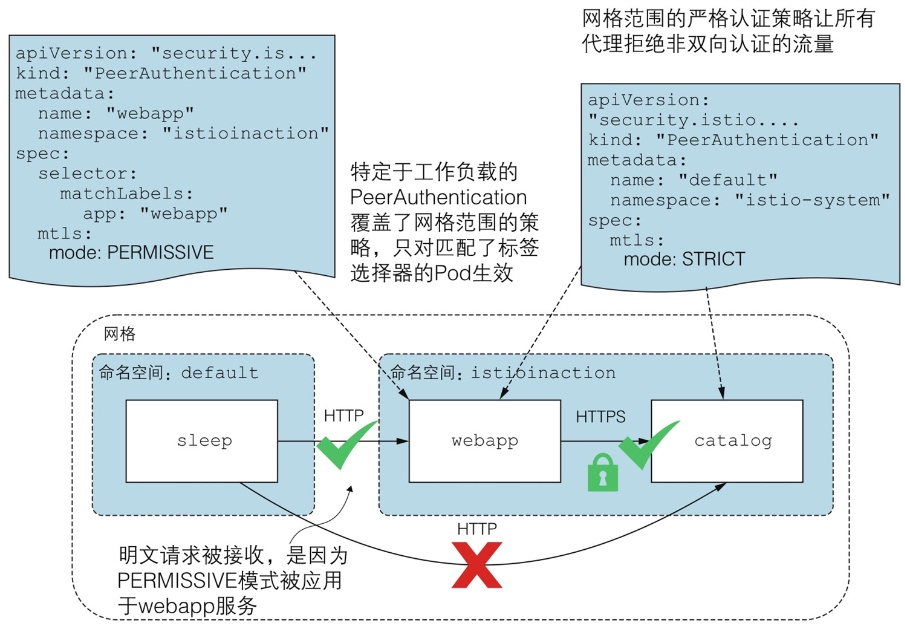
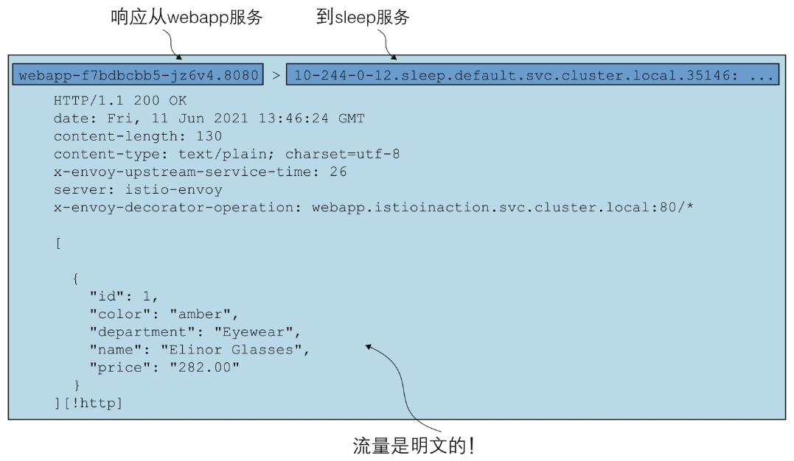

# 安全简述

PeerAuthentication 资源用于配置网格内服务间的对等身份认证（认证）

RequestAuthentication 资源用于配置代理进行 JWT 认证（认证）

AuthorizationPolicy 资源用于配置代理利用元数据来授权或拒绝请求（鉴权）



上图显示了 PeerAuthentication 和 RequestAuthentication 资源是如何配置代理来验证请求的。此时，凭证（SVID或JWT）中的数据会被提取并存储为过滤器元数据，它代表了连接身份。AuthorizationPolicy 资源根据连接身份来决定是否允许或拒绝请求。

# 对等身份认证

**网格范围的策略拒绝所有非认证的请求**

```yaml
apiVersion: security.istio.io/v1beta1
kind: PeerAuthentication
metadata:
  name: default
  namespace: istio-system
spec:
  mtls:
    mode: STRICT # 双向 TLS 模式
```

**允许非双向认证的请求**

```yaml
apiVersion: security.istio.io/v1beta1
kind: PeerAuthentication
metadata:
  name: default
  namespace: default
spec:
  mtls:
    mode: PERMISSIVE
```

**特定于工作负载的对等认证策略**

```yaml
apiVersion: security.istio.io/v1beta1
kind: PeerAuthentication
metadata:
  name: webapp
spec:
  selector:
    matchLabels:
      app: webapp
  mtls:
    mode: PERMISSIVE
```

尽管将网格范围的策略设置为 STRICT 模式，但通过设置针对特定于工作负载的策略，允许非双向认证的流量通过，直到这些服务最终被迁移到网格中（见下图）



**使用 tcpdump 捕获服务间流量**

```bash
istioctl install --set profile=demo --set values.global.proxy.privileged=true
```

【终端1】通过执行下面的 tcpdump 命令获取 Pod 的流量信息：

```bash
kubectl exec deploy/webapp -c istio-proxy -- sudo tcpdump -l --immediate-mode -vv -s 0
```

【终端2】触发从 sleep 到 webapp 的请求

```bash
kubectl exec deploy/sleep -c sleep -- curl -s webapp/api/catalog
```

【终端1】输出的明文流量信息



双向认证的流量是加密的且无法被捕获

```bash
curl webapp.default.svc/api/catalog

[{"id":1,"color":"amber","department":"Eyewear","name":"Elinor Glasses","price":"282.00"},{"id":2,"color":"cyan","department":"Clothing","name":"Atlas Shirt","price":"127.00"},{"id":3,"color":"teal","department":"Clothing","name":"Small Metal Shoes","price":"232.00"},{"id":4,"color":"red","department":"Watches","name":"Red Dragon Watch","price":"232.00"}]
```

```bash
kubectl exec deploy/catalog -c istio-proxy -- sudo tcpdump -l --immediate-mode -vv -s 0

10-244-0-55.catalog.default.svc.cluster.local.3000 > webapp-89c76ffb5-qhfxq.46336: Flags [P.], cksum 0x1d34 (incorrect -> 0xb85e), seq 1:1716, ack 1205, win 63, options [nop,nop,TS val 571673926 ecr 2940613001], length 1715
```

# 授权服务间流量

理解授权策略规则 `from`、`to`、`when`。

授权策略规则指定了连接的源和（可选的）操作，在匹配时会激活该规则。只有当其中一个规则与源和操作匹配时，授权策略才会执行，并根据 action 属性允许或拒绝该连接。

`from`: 指定请求的来源，可以是 principals, namespaces,  ipBlocks

`to`: 指定请求的操作，如请求的 host, method, path

`when`: 指定规则匹配后需要满足的条件列表，例如 http request, JWT 等

**全局策略拒绝所有请求**

为了提高安全性并简化思考过程，我们定义一个网格范围的策略，拒绝所有没有明确指定 ALLOW 策略的请求。换句话说，定义一个全局的 deny-all 策略。

```yaml
apiVersion: security.istio.io/v1beta1
kind: AuthorizationPolicy
metadata:
  name: deny-all
  namespace: istio-system
spec: {}
```

**允许来自单一命名空间的请求**

```yaml
apiVersion: security.istio.io/v1beta1
kind: AuthorizationPolicy
metadata:
  name: webapp-allow-unauthenticated-view-default-ns
  namespace: default
spec:
  selector:
    matchLabels:
      app: webapp
  rules:
    - to:
      - operation:
          methods: ["GET"]
```
