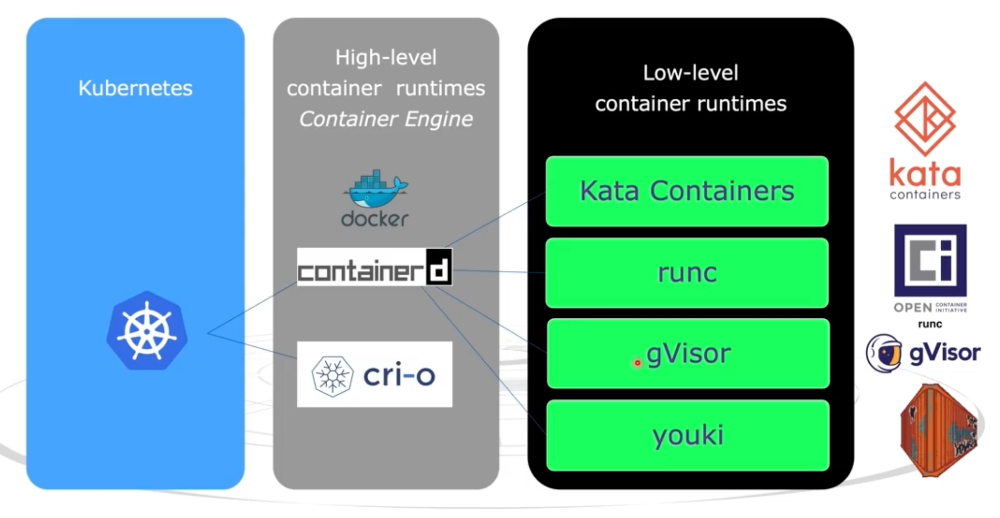
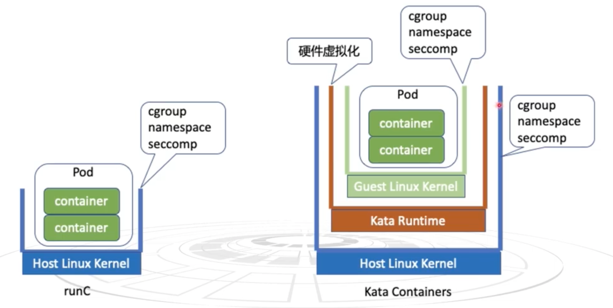
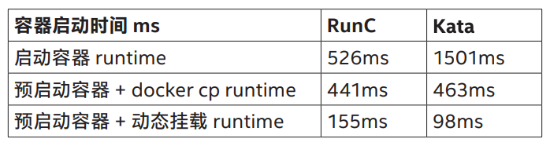

- [Kata Containers 安全容器调研](#kata-containers安全容器调研)
  - [容器运行时](#容器运行时)
  - [容器的安全问题](#容器的安全问题)
  - [性能](#性能)
  - [Kata Containers 安全容器运行时应用场景](#kata-containers安全容器运行时应用场景)
  - [动手实践](#动手实践)
    - [在 Kubernetes 集群中部署 Kata Containers 运行时](#在kubernetes集群中部署-kata-containers运行时)
    - [统计 Kata Containers 容器运行时启动业务 Pod 耗时](#统计kata-containers容器运行时启动业务-pod耗时)
    - [统计 runc 容器运行时启动业务 Pod 耗时](#统计runc容器运行时启动业务-pod耗时)

# Kata Containers 安全容器调研

Kata Containers 是一个开源项目，提供了安全容器运行时解决方案：<https://github.com/kata-containers/kata-containers/tree/main>

**总结：**

runc 容器运行时，性能高，安全性差；VM 虚拟机，性能损耗大，但安全性好；Kata Container 是**轻量级虚拟机的容器运行时**，安全性好，启动快，性能也高。

## 容器运行时

Kubernetes 是一个容器编排工具，它可以调用容器运行时接口（CRI）创建容器实例。常见的容器运行时有：containerd + runc 的组合。

<!--  -->

你可能经常听到，docker 是容器运行时，containerd 是容器运行时，runc 也是容器运行时。那它们之间有什么区别呢？

docker 和 containerd 是上层容器运行时，runc 是最低层的容器运行时。上层容器运行时负责为底层容器运行时拉取 image，创建网络（IP 地址，路由）等。下层容器运行时负责业务容层器的执行，执行业务容器里的进程。简单来说，上层容器运行时负责容器的生命周期管理，下层容器负责执行业务进程。

在 Kubernetes 中，容器运行时是可替换的，本文着重介绍 kata-containers 容器运行时，它是 runc 的替代品，我们可以使用 containerd + kata-containers 的组合，为 Kubernetes 提供安全的容器运行时环境。

## 容器的安全问题

<!--  -->

**runc 容器运行时：**

虽然 Linux 提供了 cgroup、namespace、seccomp 资源控制方案来隔离容器，但容器内的应用程序依然共享宿主机的内核，存在潜在的安全风险和资源竞争问题。如果我们将宿主机的 `/etc` 目录挂载到容器内，并以 root 权限运行容器，那么我们可以在容器内直接删除宿主机的 `/etc` 目录；又或者业务容器导致 Linux Kernel panic。

**kata-containers 容器运行时：**

kata-containers 容器运行时，采用了 Linux 内核级的资源隔离方案，理论上无安全问题。

## 性能

runc 容器运行时，性能高，安全性差；VM 虚拟机，性能损耗大，但安全性好；Kata Container 是**轻量级虚拟机的容器运行时**，安全性好，启动快，性能也高。

下图展示了[百度智能云的应用实际白皮书]((https://katacontainers.io/collateral/Kata%20Containers%E5%9C%A8%E7%99%BE%E5%BA%A6%E6%99%BA%E8%83%BD%E4%BA%91%E7%9A%84%E5%BA%94%E7%94%A8%E5%AE%9E%E8%B7%B5.pdf)) Kata Containers 与 runc 容器运行时启动性能对比图：



## Kata Containers 安全容器运行时应用场景

详见：[Kata Containers 在百度智能云的应用实践白皮书](https://katacontainers.io/collateral/Kata%20Containers%E5%9C%A8%E7%99%BE%E5%BA%A6%E6%99%BA%E8%83%BD%E4%BA%91%E7%9A%84%E5%BA%94%E7%94%A8%E5%AE%9E%E8%B7%B5.pdf)

1. 公有云在对外提供服务时，支持执行用户提交的代码。由于这些代码是不可信且不安全的，在云平台上运行用户代码可能会对我们的云平台带来风险。
2. 公有云 Serverless 应用。

## 动手实践

### 在 Kubernetes 集群中部署 Kata Containers 运行时

环境信息

| 操作系统 | CPU | 内存 | Kubernetes |
| :---- | :---- | :---- | :---- |
| Ubuntu 22.04 内核 6.5.0-35 | 4 核 2.8 GHz | 12 GB | v1.25.3 |


部署一组 Kata Containers DaemonSet

```bash
kubectl apply -f https://raw.githubusercontent.com/kata-containers/kata-containers/main/tools/packaging/kata-deploy/kata-rbac/base/kata-rbac.yaml
kubectl apply -f https://raw.githubusercontent.com/kata-containers/kata-containers/main/tools/packaging/kata-deploy/kata-deploy/base/kata-deploy.yaml
```

等待 Kata Containers 相关的组件启动

```bash
root@ubuntu:~# k get pod -n kube-system | grep kata
kata-deploy-ntlv8                          1/1     Running   0          120m
```

runtimeClass 是 Kubernetes 中的内置类型，要应用每个 Kata 容器 runtimeClass

```bash
kubectl apply -f https://raw.githubusercontent.com/kata-containers/kata-containers/main/tools/packaging/kata-deploy/runtimeclasses/kata-runtimeClasses.yaml
```

查看部署好的 Kata Containers 容器运行时

```bash
root@ubuntu:~# k get RuntimeClass
NAME                       HANDLER                    AGE
kata-clh                   kata-clh                   104m
kata-cloud-hypervisor      kata-cloud-hypervisor      104m
kata-dragonball            kata-dragonball            104m
kata-fc                    kata-fc                    104m
kata-qemu                  kata-qemu                  104m
kata-qemu-coco-dev         kata-qemu-coco-dev         104m
kata-qemu-nvidia-gpu       kata-qemu-nvidia-gpu       104m
kata-qemu-nvidia-gpu-snp   kata-qemu-nvidia-gpu-snp   104m
kata-qemu-nvidia-gpu-tdx   kata-qemu-nvidia-gpu-tdx   104m
kata-qemu-se               kata-qemu-se               104m
kata-qemu-sev              kata-qemu-sev              104m
kata-qemu-snp              kata-qemu-snp              104m
kata-qemu-tdx              kata-qemu-tdx              104m
kata-remote                kata-remote                104m
kata-stratovirt            kata-stratovirt            104m
```

### 统计 Kata Containers 容器运行时启动业务 Pod 耗时

部署 YAML 文件

```yaml
apiVersion: apps/v1
kind: Deployment
metadata:
  name: nginx-deployment-qemu
spec:
  selector:
    matchLabels:
      app: nginx-deployment-qemu
  replicas: 2
  template:
    metadata:
      labels:
        app: nginx-deployment-qemu
    spec:
      # kata-qemu 容器运行时
      runtimeClassName: kata-qemu
      containers:
      - name: nginx
        image: nginx:1.14
        ports:
        - containerPort: 80
```

根据日志显示，Kata Container 容器运行时 2s 即可启动一个 Pod

```bash
root@ubuntu:/home/hexiaodai# kubectl get pod -w
NAME                                     READY   STATUS    RESTARTS   AGE
nginx-deployment-qemu-6598d78bbc-f2kcp   0/1     Pending   0          0s
nginx-deployment-qemu-6598d78bbc-f2kcp   0/1     Pending   0          0s
nginx-deployment-qemu-6598d78bbc-f2kcp   0/1     ContainerCreating   0          0s
nginx-deployment-qemu-6598d78bbc-f2kcp   0/1     ContainerCreating   0          1s
nginx-deployment-qemu-6598d78bbc-f2kcp   1/1     Running             0          2s
```

### 统计 runc 容器运行时启动业务 Pod 耗时

部署 YAML 文件

```yaml
apiVersion: apps/v1
kind: Deployment
metadata:
  name: nginx-deployment-runc
spec:
  selector:
    matchLabels:
      app: nginx-deploy-runc
  replicas: 1
  template:
    metadata:
      labels:
        app: nginx-deploy-runc
    spec:
      containers:
      - name: nginx
        image: nginx:1.14
        ports:
        - containerPort: 80
```

根据日志显示，runc 容器运行时与 Kata Containers 容器运行时启动业务 Pod 耗时几乎一致，也是 2s

```bash
root@ubuntu:/home/hexiaodai# kubectl get pod -w
NAME                                     READY   STATUS    RESTARTS   AGE
nginx-deployment-runc-59446fd98d-9m5qx   0/1     Pending   0          0s
nginx-deployment-runc-59446fd98d-9m5qx   0/1     Pending   0          0s
nginx-deployment-runc-59446fd98d-9m5qx   0/1     ContainerCreating   0          0s
nginx-deployment-runc-59446fd98d-9m5qx   0/1     ContainerCreating   0          1s
nginx-deployment-runc-59446fd98d-9m5qx   1/1     Running             0          2s
```
