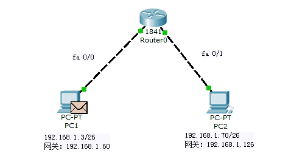
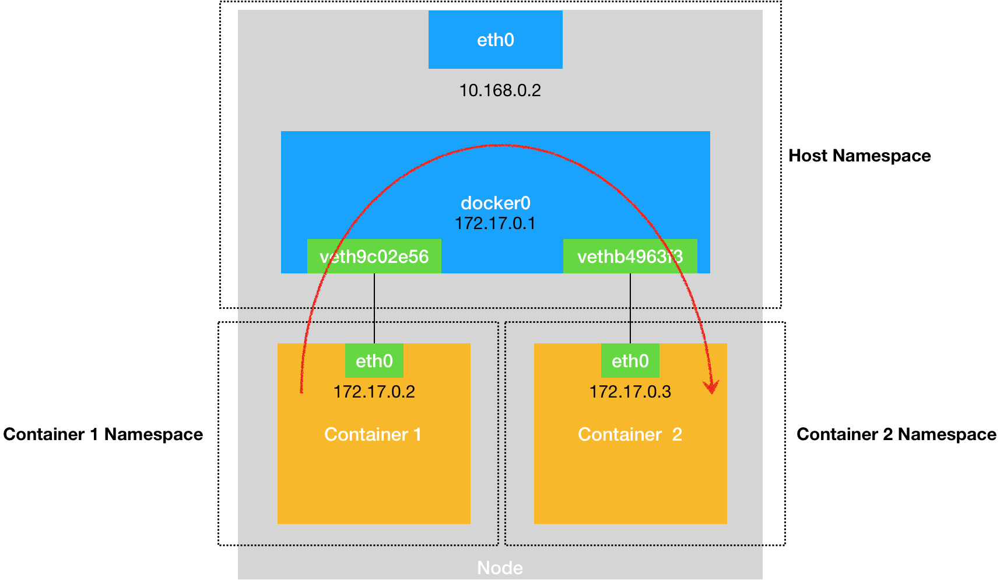
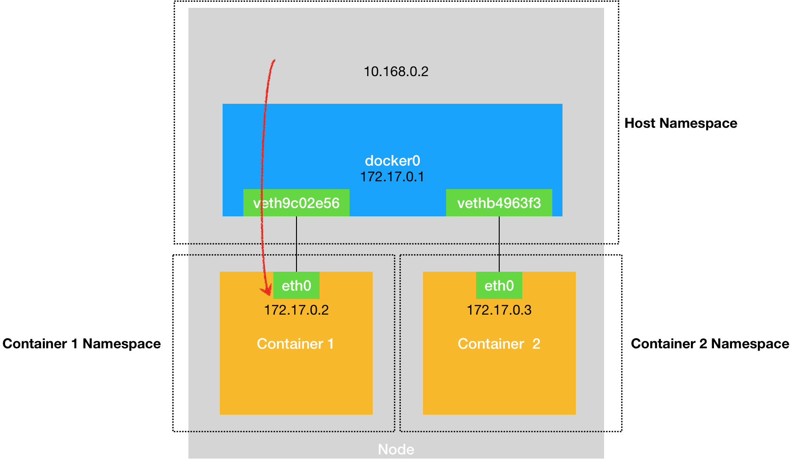
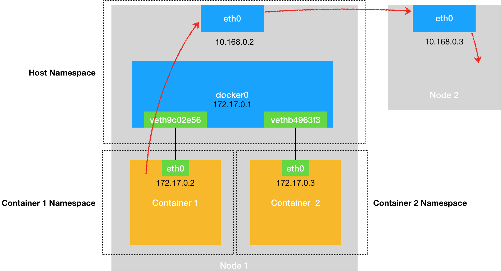
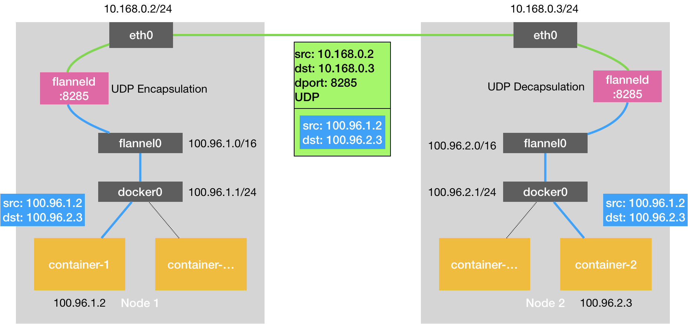
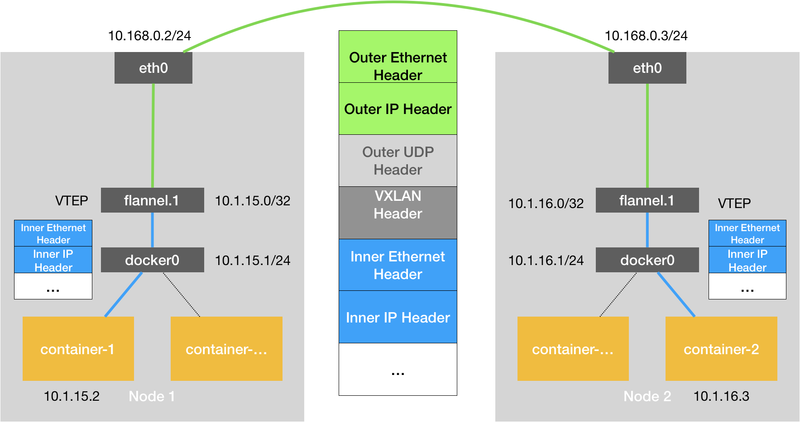

# 虚拟机、Docker、K8s、KubeVirt 网络

## 基础知识

### 计算网络地址、子网掩码中主机地址、最大 IP 地址

CIDR: 10.233.64.0/18

**网络地址**

| && | bin | dec |
| ---- | ---- | ---- |
| IP地址 | 00001010.11101001.01000000.00000000 | 10.233.64.0 |
| 子网掩码 | 11111111.11111111.11000000.00000000 | 255.255.192.0 |
| 结果 网络地址 | 00001010.11101001.01000000.00000000 | 10.233.64.0 |

**子网掩码中主机地址**

| ~ | bin | dec |
| ---- | ---- | ---- |
| 子网掩码 | 11111111.11111111.11000000.00000000 | 255.255.192.0 |
| 结果 子网掩码中主机地址 | 00000000.00000000.00111111.11111111 | 0.0.63.255 |

**最大IP地址**

| + | bin | dec |
| ---- | ---- | ---- |
| 网络地址 | 00001010.11101001.01000000.00000000 | 10.233.64.0 |
| 子网掩码中主机地址 | 00000000.00000000.00111111.11111111 | 0.0.63.255 |
| 结果 最大IP地址 | 00001010.11101001.01111111.11111111 | 10.233.127.255 |

> 判断 PC1 的 IP 为 192.168.0.3/26，PC2 的 IP 为 192.168.0.192/26，双方是否能互相通信（不考虑网关）
> 
>很简单，只需要判断 192.168.0.3/26 和 192.168.0.192/26 的网络地址是否相等即可

### 网关和路由器

- 网关的作用是将不同网络地址设备连接起来，实现数据的交换和通信
- “路由”，是指把数据从一个地方传送到另一个地方的行为和动作，而路由器，正是执行这种行为动作的机器



### 主机（Mac OS）和 vSphere 虚拟机网络互通原理

**vSphere 虚拟机**

```bash
[root@10-6-8-1 ~]# ifconfig
ens192: flags=4163<UP,BROADCAST,RUNNING,MULTICAST>  mtu 1500
        inet 10.6.8.1  netmask 255.255.0.0  broadcast 10.6.255.255
        inet6 fe80::782e:c255:c8b:8114  prefixlen 64  scopeid 0x20<link>
        inet6 fe80::9ce9:5015:92b9:31d7  prefixlen 64  scopeid 0x20<link>
        inet6 fe80::49f4:e0fd:eef2:eefa  prefixlen 64  scopeid 0x20<link>
        ether 00:50:56:b4:92:2d  txqueuelen 1000  (Ethernet)
        RX packets 1119121911  bytes 1308817698132 (1.1 TiB)
        RX errors 0  dropped 150762  overruns 0  frame 0
        TX packets 234936907  bytes 31267144464 (29.1 GiB)
        TX errors 0  dropped 0 overruns 0  carrier 0  collisions 0

[root@10-6-8-1 ~]# route -n
Kernel IP routing table
Destination     Gateway         Genmask         Flags Metric Ref    Use Iface
0.0.0.0         10.6.0.1        0.0.0.0         UG    100    0        0 ens192
10.6.0.0        0.0.0.0         255.255.0.0     U     100    0        0 ens192
```

**主机（Mac OS）**

```bash
➜  ~ ifconfig
en0: flags=8863<UP,BROADCAST,SMART,RUNNING,SIMPLEX,MULTICAST> mtu 1500
	options=400<CHANNEL_IO>
	ether d0:81:7a:9d:e9:62
	inet6 fe80::183c:68df:79da:e73d%en0 prefixlen 64 secured scopeid 0x5
	inet 10.64.1.46 netmask 0xffffff00 broadcast 10.64.1.255
	nd6 options=201<PERFORMNUD,DAD>
	media: autoselect
	status: active

➜  ~ netstat -nr
Routing tables

Internet:
Destination        Gateway            Flags        Netif Expire
default            10.64.1.1          UGSc           en0
10.64.1/24         link#5             UCS            en0      !
10.64.1.1/32       link#5             UCS            en0      !
```

主机上操作：

```bash
➜  ~ ping 10.6.8.1 -t 3
PING 10.6.8.1 (10.6.8.1): 56 data bytes
64 bytes from 10.6.8.1: icmp_seq=0 ttl=60 time=7.048 ms
64 bytes from 10.6.8.1: icmp_seq=1 ttl=60 time=31.353 ms
64 bytes from 10.6.8.1: icmp_seq=2 ttl=60 time=40.927 ms
```

很显然，vSphere 虚拟机 IP 的网络地址跟我主机网络地址不匹配（排除 default 默认路由），能 ping 通是因为我主机上有一条默认路由规则：

```bash
➜  ~ netstat -nr
Routing tables

Internet:
Destination        Gateway            Flags        Netif Expire
default            10.64.1.1          UGSc           en0
```

default 路由规则对应的网卡是 en0，en0 是连接到 DaoCloud 的路由器（WIFI）。网关地址是 10.64.1.1，这个地址是路由分配的，并且存储在路由器内部。

回过头来看 vSphere 虚拟机的网卡，发现只有一张默认的 ens192 网卡（这是全新安装的虚拟机，如果安装了 k8s 或者 docker 可能会有一张 cni0 或者 docker0 虚拟网卡）。

所以，可以肯定的说 10.6.0.1 这个网关一定是存在于 DaoCloud 路由器上。

```bash
[root@10-6-8-1 ~]# route -n
Kernel IP routing table
Destination     Gateway         Genmask         Flags Metric Ref    Use Iface
0.0.0.0         10.6.0.1        0.0.0.0         UG    100    0        0 ens192
```

```
路由器的作用简单文符示意图: ✗ 否定；<——> 连接；✓ 可行；

A: 主机
B: vSphere 虚拟机
C: Gateway（DaoCloud 路由器）
D: Gateway（DaoCloud-Guest 路由器）

A <——> C <——> B ✓
A <——> D <——> B ✗
```

## Docker

### Docker 容器之间的通信原理（单节点）

为了理解这个问题，其实可以把每一个容器看做一台主机。

> 如果想要实现两台主机之间的通信，最直接的办法，就是把它们用一根网线连接起来；而如果你想要实现多台主机之间的通信，那就需要用网线，把它们连接在一台交换机上。
> 
> 在 Linux 中，能够起到虚拟交换机作用的网络设备，是网桥（Bridge）。它是一个工作在数据链路层（Data Link）的设备，主要功能是根据 MAC 地址学习来将数据包转发到网桥的不同端口（Port）上。

Docker 项目会默认在宿主机上创建一个名叫 docker0 的网桥，凡是连接在 docker0 网桥上的容器，就可以通过它来进行通信。

```bash
[root@10-6-8-1 ~]# ip a
3: docker0: <NO-CARRIER,BROADCAST,MULTICAST,UP> mtu 1500 qdisc noqueue state DOWN group default
    link/ether 02:42:15:82:98:cb brd ff:ff:ff:ff:ff:ff
    inet 172.17.0.1/16 brd 172.17.255.255 scope global docker0
       valid_lft forever preferred_lft forever
```

“交换机”已经有了，“网线”上哪找呢？

这时候，我们就需要使用一种名叫 Veth Pair 的虚拟设备了。Veth Pair 设备的特点是：它被创建出来后，总是以两张虚拟网卡（Veth Peer）的形式成对出现的。并且，从其中一个“网卡”发出的数据包，可以直接出现在与它对应的另一张“网卡”上，哪怕这两个“网卡”在不同的 Network Namespace 里。

比如，启动一个 nginx-1 的容器：

```bash
docker run -d --name nginx-1 nginx
```

然后进入到这个容器查看它的网络设备：

```bash
# 在宿主机上
$ docker exec -it nginx-1 /bin/bash
# 在容器里
root@2b3c181aecf1:/# ifconfig
eth0: flags=4163<UP,BROADCAST,RUNNING,MULTICAST>  mtu 1500
        inet 172.17.0.2  netmask 255.255.0.0  broadcast 0.0.0.0
        inet6 fe80::42:acff:fe11:2  prefixlen 64  scopeid 0x20<link>
        ether 02:42:ac:11:00:02  txqueuelen 0  (Ethernet)
        RX packets 364  bytes 8137175 (7.7 MiB)
        RX errors 0  dropped 0  overruns 0  frame 0
        TX packets 281  bytes 21161 (20.6 KiB)
        TX errors 0  dropped 0 overruns 0  carrier 0  collisions 0
        
$ route
Kernel IP routing table
Destination     Gateway         Genmask         Flags Metric Ref    Use Iface
default         172.17.0.1      0.0.0.0         UG    0      0        0 eth0
172.17.0.0      0.0.0.0         255.255.0.0     U     0      0        0 eth0
```

可以看到，这个容器里有一张叫作 eth0 的网卡，它正是一个 Veth Pair 设备在容器里的这一端。通过 route 命令查看 nginx-1 容器的路由表，可以看到，这个 eth0 网卡是这个容器里的默认路由设备；所有对 172.17.0.0/16 网段的请求，会被交给 eth0 来处理。

而这个 Veth Pair 设备的另一端，则在宿主机上：

```bash
# 在宿主机上
$ ifconfig
...
docker0   Link encap:Ethernet  HWaddr 02:42:d8:e4:df:c1  
          inet addr:172.17.0.1  Bcast:0.0.0.0  Mask:255.255.0.0
          inet6 addr: fe80::42:d8ff:fee4:dfc1/64 Scope:Link
          UP BROADCAST RUNNING MULTICAST  MTU:1500  Metric:1
          RX packets:309 errors:0 dropped:0 overruns:0 frame:0
          TX packets:372 errors:0 dropped:0 overruns:0 carrier:0
 collisions:0 txqueuelen:0 
          RX bytes:18944 (18.9 KB)  TX bytes:8137789 (8.1 MB)
veth9c02e56 Link encap:Ethernet  HWaddr 52:81:0b:24:3d:da  
          inet6 addr: fe80::5081:bff:fe24:3dda/64 Scope:Link
          UP BROADCAST RUNNING MULTICAST  MTU:1500  Metric:1
          RX packets:288 errors:0 dropped:0 overruns:0 frame:0
          TX packets:371 errors:0 dropped:0 overruns:0 carrier:0
 collisions:0 txqueuelen:0 
          RX bytes:21608 (21.6 KB)  TX bytes:8137719 (8.1 MB)
          
$ brctl show
bridge name bridge id  STP enabled interfaces
docker0  8000.0242d8e4dfc1 no  veth9c02e56
```

通过 ifconfig 命令的输出，可以看到，nginx-1 容器对应的 Veth Pair 设备，在宿主机上是一张虚拟网卡。它的名字叫作 veth9c02e56。并且，通过 brctl show 的输出，你可以看到这张网卡被“插”在了 docker0 上。

现在，我们可以来回答这个问题：

> “交换机”已经有了，“网线”上哪找呢？

在 Linux 中，能够起到虚拟交换机作用的网络设备是网桥（Bridge），Veth Pair 是一对虚拟的网络设备，它们成对出现，通过一个虚拟电缆连接在一起。

这是同一个宿主机上的不同容器通信流程：



**总结：**

被限制在 Network Namespace 里的容器进程，实际上是通过 Veth Pair 设备 + 宿主机网桥的方式，实现了跟同其他容器的数据交换。

### 宿主机与 Docker 容器之间的通信原理（单节点）

查看宿主机的路由表，可以看到 172.17.0.0/16 网段的 IP 数据包会到达 docker0 网桥：

```bash
[root@10-6-8-1 ~]# route -n
Kernel IP routing table
Destination     Gateway         Genmask         Flags Metric Ref    Use Iface
172.17.0.0      0.0.0.0         255.255.0.0     U     0      0        0 docker0
```

查看 docker0 网桥上的 Veth Pair 设备，可以看到 veth9c02e56 被“插”在了 docker0 网桥上：

> veth9c02e56 这对虚拟网卡的一端插在宿主机的 docker0 网桥上；另一端在 nginx-1 容器里充当 eth0 网卡。

```bash
$ brctl show
bridge name bridge id  STP enabled interfaces
docker0  8000.0242d8e4dfc1 no  veth9c02e56
```

当我们在宿主机上 ping 172.17.0.2（nginx-1 容器 IP），这个请求的数据包，会根据路由规则到达 docker0 网桥，然后被转发到对应的 Veth Pair 设备（veth9c02e56），最后出现在容器里。

> 172.17.0.2 在 172.17.0.0/16 网段内，所以 IP 数据包会到达 docker0 网桥。这里没有问题。



同样地，当一个容器试图连接到另外一个宿主机时，比如：ping 10.168.0.3，它发出的请求数据包，首先经过 docker0 网桥出现在宿主机上。然后根据宿主机的路由表里的直连路由规则（10.168.0.0/24 via eth0），对 10.168.0.3 的访问请求就会交给宿主机的 eth0 处理。

> via eth0 表示流量应该通过名为 eth0 的网络接口进行路由。这是指定路由的下一跳设备，即数据包应该通过哪个网络接口发送出去。

所以接下来，这个数据包就会经宿主机的 eth0 网卡转发到宿主机网络上，最终到达 10.168.0.3 对应的宿主机上。



**总结**

当遇到容器连不通“外网”的时候，应该先试试 docker0 网桥能不能 ping 通，然后查看一下跟 docker0 和 Veth Pair 设备相关的 iptables 规则是不是有异常。

例如：

```bash
[root@10-6-8-1 ~]# ip a
3: docker0: <NO-CARRIER,BROADCAST,MULTICAST,UP> mtu 1500 qdisc noqueue state DOWN group default
    link/ether 02:42:15:82:98:cb brd ff:ff:ff:ff:ff:ff
    inet 172.17.0.1/16 brd 172.17.255.255 scope global docker0
       valid_lft forever preferred_lft forever

[root@10-6-8-1 ~]# ping 172.17.0.1 -w 3
PING 172.17.0.1 (172.17.0.1) 56(84) bytes of data.
64 bytes from 172.17.0.1: icmp_seq=1 ttl=64 time=0.113 ms
64 bytes from 172.17.0.1: icmp_seq=2 ttl=64 time=0.048 ms
64 bytes from 172.17.0.1: icmp_seq=3 ttl=64 time=0.171 ms

[root@10-6-8-1 ~]# sudo iptables -t nat -L -n -v | grep docker0
    1    84 MASQUERADE  all  --  *      !docker0  172.17.0.0/16        0.0.0.0/0
    0     0 RETURN     all  --  docker0 *       0.0.0.0/0            0.0.0.0/0
```

> iptables 规则有点复杂，这里不过多解释。

这些 iptables 规则允许 Docker 容器通过 docker0 网桥与外部网络通信，并确保容器的流量能够正确出站，并且在出站时进行了源地址转换，以使得容器的流量看起来像是来自于宿主机。

> 正确的源 IP 地址是两个主机能够互相通信的必要条件之一。这里没有问题。

### Docker 容器之间的通信原理（多节点）

如果在另外一台宿主机（比如：10.168.0.3）上，也有一个 Docker 容器。那么，我们的 nginx-1 容器又该如何访问它呢？

在 Docker 的默认配置下，一台宿主机上的 docker0 网桥，和其他宿主机上的 docker0 网桥，没有任何关联，它们互相之间也没办法连通。所以，连接在这些网桥上的容器，自然也没办法进行通信了。这其实就是容器的“跨主通信”问题。

## K8s

### 容器跨主机网络原理

#### Flannel - UDP

现在我有两台宿主：

- 宿主机 Node 1 上有一个容器 container-1，它的 IP 地址是 100.96.1.2，对应的 docker0 网桥的地址是：100.96.1.1/24。
- 宿主机 Node 2 上有一个容器 container-2，它的 IP 地址是 100.96.2.3，对应的 docker0 网桥的地址是：100.96.2.1/24。

现在的任务，就是让 container-1 访问 container-2。

container-1 向 container-2 发起一个 IP 数据包，由于目的地址 100.96.2.3 并不在 Node 1 的 docker0 网桥的网段里，所以会走 `100.96.0.0/16 dev flannel0` 路由规则。可以在 Node 1 上执行 `ip route`：

```bash
# 在 Node 1 上
$ ip route
default via 10.168.0.1 dev eth0
100.96.0.0/16 dev flannel0  proto kernel  scope link  src 100.96.1.0
100.96.1.0/24 dev docker0  proto kernel  scope link  src 100.96.1.1
10.168.0.0/24 dev eth0  proto kernel  scope link  src 10.168.0.2
```

可以看到 IP 包的目的地址是 100.96.2.3，它只能匹配到 `100.96.0.0/16 dev flannel0` 路由规则，于是，IP 包就被转发到了 flannel0 设备中（Tunnel 设备）。

> Tunnel 设备的功能非常简单，即：在操作系统内核和用户应用程序之间传递 IP 包。

当 Tunnel 设备收到 IP 包之后，会交给创建这个设备的应用程序，也就是 Flannel 进程。这是一个从内核态向用户态的流动方向。flanneld 看到了这个 IP 包的目的地址，是 100.96.2.3，就把它发送给了 Node 2 宿主机。

🙋🏻‍♂️问：flanneld 是如何知道这个 IP 地址对应的容器，是运行在 Node 2 上的呢？

再来回顾一下，Node 1 的子网是 100.96.1.0/24，container-1 的 IP 地址是 100.96.1.2；Node 2 的子网是 100.96.2.0/24，container-2 的 IP 地址是 100.96.2.3。

而这些子网与宿主机的对应关系，正是保存在 Etcd 当中：

```bash
$ etcdctl ls /coreos.com/network/subnets
/coreos.com/network/subnets/100.96.1.0-24
/coreos.com/network/subnets/100.96.2.0-24

$ etcdctl get /coreos.com/network/subnets/100.96.2.0-24
{"PublicIP":"10.168.0.3"}
```

而对于 flanneld 来说，只要 Node 1 和 Node 2 是互通的，那么 flanneld 作为 Node 1 上的一个普通进程，就一定可以通过上述 IP 地址（10.168.0.3）访问到 Node 2，这没有任何问题。

每台宿主机上的 flanneld，都监听着一个 8285 端口，所以 flanneld 只要把 UDP 包发往 Node 2 的 8285 端口即可。所以这时候 Node 2 的 flanneld 就可以从这个 UDP 包里解析出封装在里面的、container-1 发来的原 IP 包。

而接下来 flanneld 的工作就非常简单了：flanneld 会直接把这个 IP 包发送给它所管理的 Tunnel 设备，即 flannel0 设备。

Node 2 上的路由表，跟 Node 1 非常类似，如下所示：

```bash
# 在 Node 2 上
$ ip route
default via 10.168.0.1 dev eth0
100.96.0.0/16 dev flannel0  proto kernel  scope link  src 100.96.2.0
100.96.2.0/24 dev docker0  proto kernel  scope link  src 100.96.2.1
```

由于这个 IP 包的目的地址是 100.96.2.3，它跟第三条、也就是 100.96.2.0/24 网段对应的路由规则匹配更加精确。所以，Linux 内核就会按照这条路由规则，把这个 IP 包转发给 docker0 网桥。

接下来的流程，如同本文中 **Docker 容器之间的通信原理（单节点）** 一样。

原理图，如下所示。



**总结**

Flannel UDP 模式提供的其实是一个三层的 Overlay 网络，即：它首先对发出端的 IP 包进行 UDP 封装，然后在接收端进行解封装拿到原始的 IP 包，进而把这个 IP 包转发给目标容器。这就好比，Flannel 在不同宿主机上的两个容器之间打通了一条“隧道”，使得这两个容器可以直接使用 IP 地址进行通信，而无需关心容器和宿主机的分布情况。

**性能**

Flannel UDP 模式，性能非常差，其网络性能损耗大概在 20% - 30% 左右。但实现原理非常容易理解。

性能差的原因：

- 第一次：用户态的容器进程发出的 IP 包经过 docker0 网桥进入内核态
- 第二次：IP 包根据路由表进入 TUN（flannel0）设备，从而回到用户态的 flanneld 进程
- 第三次：flanneld 进行 UDP 封包之后重新进入内核态，将 UDP 包通过宿主机的 eth0 发出去

#### Flannel - VXLAN

> VXLAN，即 Virtual Extensible LAN（虚拟可扩展局域网），是 Linux 内核本身就支持的一种网络虚似化技术。VXLAN 可以完全在内核态实现上述封装和解封装的工作，从而通过与 Flannel UDP 相似的“隧道”机制，构建出覆盖网络（Overlay Network）。

VXLAN 会在宿主机上设置一个特殊的网络设备作为“隧道”的两端。这个设备就叫作 VTEP，即：VXLAN Tunnel End Point（虚拟隧道端点）。

而 VTEP 设备的作用，其实跟前面的 flanneld 进程非常相似。只不过，它进行封装和解封装的对象，是二层数据帧（Ethernet frame）；而且这个工作的执行流程，全部是在内核里完成的（因为 VXLAN 本身就是 Linux 内核中的一个模块）。

原理图，如下所示。



可以看到，图中每台宿主机上名叫 flannel.1 的设备，就是 VXLAN 所需的 VTEP 设备，它既有 IP 地址，也有 MAC 地址。

现在，container-1 的 IP 地址是 10.1.15.2，要访问的 container-2 的 IP 地址是 10.1.16.3。

**第一步，** container-1 发出的 IP 包，会先出现在 docker0 网桥，然后被路由到本机 flannel.1 设备进行处理。接下来我们把这个 IP 包称为“原始 IP 包”。

**第二步，** 封装成 VXLAN 能够识别的二层数据帧。下面我们把它称为”内部数据帧“。

> 对于宿主机网络来说这个”内部数据帧“没有什么实际意义，并不能在宿主机二层网络里传输。

从图 3 的 Flannel VXLAN 模式的流程图中我们可以看到，10.1.16.0 正是 Node 2 上的 VTEP 设备（也就是 flannel.1 设备）的 IP 地址。接下来我们把 Node 1 和 Node 2 上的 flannel.1 设备分别称为“源 VTEP 设备”和“目的 VTEP 设备”。

“源 VTEP 设备”收到“源 IP 包”后，需要把“源 IP 包”加上一个目的 MAC 地址，封装成一个二层数据帧，然后发送给“目的 VTEP 设备”

🙋🏻‍♂️问：”目的 VTEP 设备“的 MAC 地址是什么？

Node 1 的 flanneld 进程启动时，会自动会将 Node 2 的 VTEP 设备的 MAC 地址添加到 Node 1 上。可以使用 `ip` 命令：

```bash
# 在 Node 1 上
$ ip neigh show dev flannel.1
10.1.16.0 lladdr 5e:f8:4f:00:e3:37 PERMANENT
```

这条记录的意思非常明确，即：IP 地址 10.1.16.0，对应的 MAC 地址是 5e:f8:4f:00:e3:37。

现在，有了”目的 VTEP 设备“的 MAC 地址，Linux 内核就可以开始二层封包工作了。这个二层帧的格式，如下所示：


**第三步，** 对“内部数据帧”进一步封装成为宿主机网络里的一个普通的数据帧，让它能通过宿主机的 eth0 网卡进行传输。下面我们把它称为”外部数据帧“。

现在，我们还缺少 Node 2 宿主机的 IP 地址（”外部数据帧“的目的 IP 地址）。flanneld 启动的时候，把 Node 2 宿主机的 IP地址和 ”VTEP 设备“ 的 MAC 地址存进了 FDB 的转发数据库。可以使用 `bridge fdb` 命令查看：

```bash
# 在 Node 1 上，使用“目的 VTEP 设备”的 MAC 地址进行查询
$ bridge fdb show flannel.1 | grep 5e:f8:4f:00:e3:37
5e:f8:4f:00:e3:37 dev flannel.1 dst 10.168.0.3 self permanent
```

有了 Node 2 宿主机”目的 IP 地址“，接下来的流程，就是一个正常的、宿主机网络上的封包工作。这个”外部数据帧“的格式，如下所示：


这样，封包工作就宣告完成了。

接下来，Node 1 上的 flannel.1 设备就可以把这个数据帧从 Node 1 的 eth0 网卡发出去。显然，这个帧会经过宿主机网络来到 Node 2 的 eth0 网卡。这没有任何问题。

**第四步，** Node 2 的 eth0 网卡收到这个数据包，内核网络栈会发现这个数据帧里有 VXLAN Header，并且 VNI=1。所以 Linux 内核会对它进行拆包，拿到里面的内部数据帧，把它交给 Node 2 上的 flannel.1 设备。

**第五步，** Node 2 的 flannel.1 设备则会进一步拆包，取出“原始 IP 包”。接下来就回到了本文中 **Docker 容器之间的通信原理（单节点）** 处理流程。最终，IP 包就进入到了 container-2 容器的 Network Namespace 里。

**总结**

Flannel VXLAN 模式的工作原理和 Flannel UDP 模式的工作原理，基本一致。这两种模式其实都可以称作“隧道”机制。

VXLAN 模式组建的覆盖网络，其实就是一个由不同宿主机上的 VTEP 设备，也就是 flannel.1 设备组成的虚拟二层网络。对于 VTEP 设备来说，它发出的“内部数据帧”就仿佛是一直在这个虚拟的二层网络上流动。这，也正是覆盖网络的含义。

#### Flannel - host-gw 和 Calico

待补充
