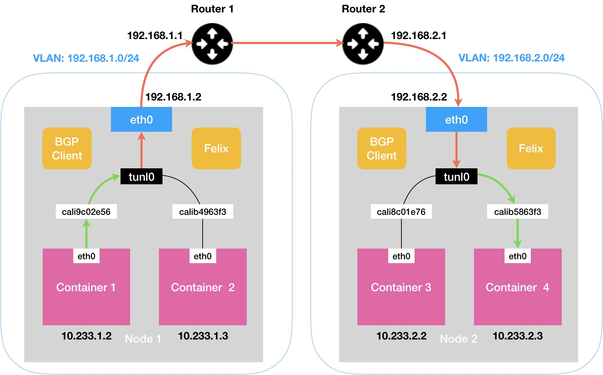

- [跨主机通信 Calico IPIP 动手实验](#跨主机通信-calico-ipip-动手实验)
  - [实验目的](#实验目的)
  - [实验环境](#实验环境)
  - [动手实验](#动手实验)
  - [总结](#总结)

# 跨主机通信 Calico IPIP 动手实验

本文会在多个节点上实验 “路由 + 封包” 的网络模型，揭示 Calico 项目 IPIP 网络模式的实现原理。

我们按照下图创建网络拓扑，让 Node-1 和 Node-2 的之间的容器网络互通。




Calico IPIP 的工作原理，结合了路由模式和 IPIP 协议。将每个容器 IP 包的下一跳，设置成目的 Node 的 IP，发送设备设置成 tunl0 设备。tunl0 是一个 IP 隧道设备，负责将容器的 IP 包直接封装在宿主机网络的 IP 包中。经过 tunl0 设备封装后新的 IP 包的目的地址正是容器 IP 包的下一跳地址。这样，原先从容器到目的 Node 的 IP 包，就变成了从当前 Node 到目的 Node 的 IP 包。所以，这个 IP 包离开当前 Node 后，就可以经过路由器，最终到达目的 Node。

下图中，左边是容器发出的 IP 包，右边是容器 IP 包进入 tunl0 设备后，被重新封装后的 IP 包。


## 实验目的

掌握 Calico IPIP 路由 + 封包模式工作原理，提高 K8s + Calico IPIP 部署模式下，网络排障的基本能力。

## 实验环境

| Node | 用户 | 主机网卡 | 主机 IP | K8s 版本 | CNI 插件 |
| :---- | :---- | :---- | :---- | :---- | :---- |
| virtnest-rook-ceph-1 | root | ens192 | 10.7.120.11 | v1.25.4 | Calico |
| virtnest-rook-ceph-2 | root | ens192 | 10.7.120.12 | v1.25.4 | Calico |
| virtnest-rook-ceph-3 | root | ens192 | 10.7.120.13 | v1.25.4 | Calico |

*注意，Calico 已经开启 IPIP 模式*

## 动手实验

1. 分别在 `virtnest-rook-ceph-1`、`virtnest-rook-ceph-2`、`virtnest-rook-ceph-3` 节点部署 sleep-curl 容器。

   ```bash
   kubectl create ns sleep-curl
   kubectl run sleep-curl-1 -n sleep-curl --image=curlimages/curl --overrides='{"spec": {"nodeName": "virtnest-rook-ceph-1"}}' -- /bin/sh -c 'sleep 100000'
   kubectl run sleep-curl-2 -n sleep-curl --image=curlimages/curl --overrides='{"spec": {"nodeName": "virtnest-rook-ceph-2"}}' -- /bin/sh -c 'sleep 100000'
   kubectl run sleep-curl-3 -n sleep-curl --image=curlimages/curl --overrides='{"spec": {"nodeName": "virtnest-rook-ceph-3"}}' -- /bin/sh -c 'sleep 100000'
   ```

   查看部署结果：

   ```bash
   kubectl get pod -n sleep-curl -o wide
   NAME           READY   STATUS    RESTARTS   AGE   IP               NODE                   NOMINATED NODE   READINESS GATES
   sleep-curl-1   1/1     Running   0          65s   10.233.107.250   virtnest-rook-ceph-1   <none>           <none>
   sleep-curl-2   1/1     Running   0          15s   10.233.109.178   virtnest-rook-ceph-2   <none>           <none>
   sleep-curl-3   1/1     Running   0          14s   10.233.88.225    virtnest-rook-ceph-3   <none>           <none>
   ```

2. 查看 `virtnest-rook-ceph-1` 节点的路由表和网卡信息：

   ```bash
   route -n
   Kernel IP routing table
   Destination     Gateway         Genmask         Flags Metric Ref    Use Iface
   0.0.0.0         10.7.0.1        0.0.0.0         UG    100    0        0 ens192
   <...>
   10.233.88.225   0.0.0.0         255.255.255.255 UH    0      0        0 cali747350e5fc9
   10.233.109.0    10.7.120.12     255.255.255.0   UG    0      0        0 tunl0
   10.233.88.0     10.7.120.13     255.255.255.0   UG    0      0        0 tunl0

   ip link show cali747350e5fc9
   114: cali747350e5fc9@if4: <BROADCAST,MULTICAST,UP,LOWER_UP> mtu 1480 qdisc noqueue state UP mode DEFAULT group default
       link/ether ee:ee:ee:ee:ee:ee brd ff:ff:ff:ff:ff:ff link-netns cni-9d817ca4-e9f0-67cc-bfd2-cdb1424ce1f9
   ```

   发现，`sleep-curl-1` 容器所在的节点是 `virtnest-rook-ceph-1`，IP 地址是 10.233.88.225。并且路由表中有一条 `10.233.88.225  0.0.0.0 255.255.255.255 UH 0 0 0 cali747350e5fc9` 规则，所有访问 10.233.88.225 的 IP 包都会路由到 `cali747350e5fc9` 网卡（这是一对 Veth Pairs 虚拟网卡，另一端在 sleep-curl-1 容器中充当 eth0 网卡）。

   已知 `virtnest-rook-ceph-1`、`virtnest-rook-ceph-2`、`virtnest-rook-ceph-3` 节点的 IP 分别是 10.7.120.11、10.7.120.12、10.7.120.13。根据路由表规则可得，所有发往 10.233.109.0/24、10.233.88.0/24 网段的 IP 包都会进入 tunl0 隧道，而 10.233.109.0/24、10.233.88.0/24 网段就是 `virtnest-rook-ceph-2`、`virtnest-rook-ceph-3` 节点 Pod 所使用的网段，这里没有任何问题。

   `virtnest-rook-ceph-2`、`virtnest-rook-ceph-3` 节点主机的路由表与 `virtnest-rook-ceph-1` 节点类似，这里不再赘述。

3. 测试 Pod 跨节点通信

   ```bash
   # 进入 sleep-curl-1，然后使用 ping 命令访问 sleep-curl-2 Pod 的 IP
   kubectl exec -it -n sleep-curl sleep-curl-1 /bin/sh
   ping 10.233.109.177
   ```

   使用 tcpdump 分别抓 sleep-curl-1 Pod 内的 eth0 虚拟网卡、calixxx（Veth Pairs 的一端）、tunl0、ens192 的数据包：

   > sleep-curl-1 Pod 内没有安装 tcpdump，这里使用 `ip netns exec cin-xxx sh` 进入到 Pod 的网络命名空间，这样就可以共享宿主机的文件系统了。
   > 
   > 这里没有找到合适的方法判断 sleep-curl-1 Pod 所在的 Network Namespace 名字，所以使用 `ls /var/run/netns` 命令，通过 Pod 创建的时间确定。

   ```bash
   # 查看 sleep-curl-1 Pod 所在的 Network Namespace
   ls -l /var/run/netns/
   <...>
   -r--r--r-- 1 root root 0 Dec  7 15:30 cni-370b6c07-ba0d-d8da-81dc-fa0f779bbba2

   # 进入 sleep-curl-1 Pod 的 Network Namespace
   ip netns exec cni-370b6c07-ba0d-d8da-81dc-fa0f779bbba2 sh

   # 确认 eth0 虚拟网卡的 IP 与 sleep-curl-1 Pod IP 是否一致
   ip a
   4: eth0@if115: <BROADCAST,MULTICAST,UP,LOWER_UP> mtu 1480 qdisc noqueue state UP group default
       link/ether 9a:f7:a3:bb:ea:2b brd ff:ff:ff:ff:ff:ff link-netnsid 0
       inet 10.233.107.250/32 scope global eth0
          valid_lft forever preferred_lft forever
       inet6 fe80::98f7:a3ff:febb:ea2b/64 scope link
          valid_lft forever preferred_lft forever

   # tcpdump: sleep-curl-1 Pod 内的 eth0 虚拟网卡（Veth Pairs 设备）
   tcpdump -i eth0 -n
   tcpdump: verbose output suppressed, use -v or -vv for full protocol decode
   listening on eth0, link-type EN10MB (Ethernet), capture size 262144 bytes
   16:16:51.275094 IP 10.233.107.250 > 10.233.109.178: ICMP echo request, id 21, seq 165, length 64
   16:16:51.275478 IP 10.233.109.178 > 10.233.107.250: ICMP echo reply, id 21, seq 165, length 64

   # 退出 cni-370b6c07-ba0d-d8da-81dc-fa0f779bbba2 网络命名空间
   exit

   # tcpdump: cali747350e5fc9（sleep-curl-1 Pod 内 eth0 虚拟网卡的另一端）
   tcpdump -i cali747350e5fc9 -n
   tcpdump: verbose output suppressed, use -v or -vv for full protocol decode
   listening on cali747350e5fc9, link-type EN10MB (Ethernet), capture size 262144 bytes
   16:27:01.748913 IP 10.233.107.250 > 10.233.109.178: ICMP echo request, id 22, seq 0, length 64
   16:27:01.749439 IP 10.233.109.178 > 10.233.107.250: ICMP echo reply, id 22, seq 0, length 64

   # tcpdump: tunl0
   tcpdump -i tunl0 -n | grep 10.233.107.250
   tcpdump: verbose output suppressed, use -v or -vv for full protocol decode
   listening on tunl0, link-type RAW (Raw IP), capture size 262144 bytes
   16:28:23.948982 IP 10.233.107.250 > 10.233.109.178: ICMP echo request, id 23, seq 0, length 64
   16:28:23.949208 IP 10.233.109.178 > 10.233.107.250: ICMP echo reply, id 23, seq 0, length 64

   # tcpdump: ens192
   tcpdump -i ens192 -n | grep 10.233.107.250
   tcpdump: verbose output suppressed, use -v or -vv for full protocol decode
   listening on ens192, link-type EN10MB (Ethernet), capture size 262144 bytes
   16:29:13.365037 IP 10.7.120.11 > 10.7.120.12: IP 10.233.107.250 > 10.233.109.178: ICMP echo request, id 24, seq 0, length 64 (ipip-proto-4)
   16:29:13.365510 IP 10.7.120.12 > 10.7.120.11: IP 10.233.109.178 > 10.233.107.250: ICMP echo reply, id 24, seq 0, length 64 (ipip-proto-4)
   ```

   通过 tcpdump 分别监听：sleep-curl-1 Pod 内的 eth0 虚拟网卡、cali747350e5fc9（sleep-curl-1 Pod 内 eth0 虚拟网卡的另一端）、tunl0、ens192 宿主机网卡。

   发现 sleep-curl-1 Pod 的 eth0 虚拟网卡、cali747350e5fc9、tunl0，数据包的源地址和目的地址分别是 sleep-curl-1 和 sleep-curl-2 Pod 的 eth0 虚拟网卡的 IP。

   ens192 宿主机网卡，sleep-curl-1 和 sleep-curl-2 Pod 之间传输的 IP 包，被 tunl0 设备使用 IPIP 协议，封装成一个新的 IP 包。这个新 IP 包的源地址和目的地址分别是 `virtnest-rook-ceph-1` 节点和 `virtnest-rook-ceph-2` 节点 ens192 网卡的 IP。

## 总结

通过部署 K8s + Calico IPIP 模式的多节点集群，分别在各个 Node 上部署了 sleep-curl Pod。然后通过 tcpdump 工具监听并且分析了 sleep-curl-1 到 sleep-curl-2 Pod 之间通信所经过的所有网络设备。发现 Calico IPIP 和 Flannle VXLAN 都是采用封包来实现跨主机通信的。不同的地方是 Flannle 使用 Linux Bridge 设备（虚拟交换机）将容器连接在同一个局域网内实现容器网络互通，VXLAN 设备负责对进出 Node 的容器 IP 包进行封装，并且将封装好的 IP 包放到宿主机的网络协议栈中传输；而 Calico IPIP 通过设置主机路由表，将同一节点的容器 IP 包直接路由到目的容器的网卡（veth pairs 设备）实现网络互通。对于跨节点容器通信则通过设置容器 IP 包的下一跳地址为目的主机的 IP 和 tunl0 设备，将进出 Node 的容器 IP 包进行封装，并且将封装好的 IP 包放到宿主机的网络协议栈中传输。
