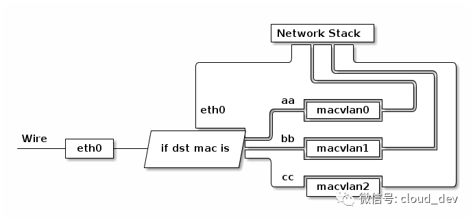

# 跨主机通信 macvlan 动手实验

macvlan 是 Linux kernel 提供的网络虚拟化解决方案，准确说这是一种网卡虚拟化的解决方案。因为 macvlan 这种技术能将一块物理网卡虚拟成多块虚拟网卡，相当于物理网卡施展了多重影分身之术，由一个变多个。macvlan 子接口和原来的主接口是完全独立的，可以单独配置 MAC 地址和 IP 地址，并且与主接口共享同一个广播域。

主接口会根据收到包的目的 MAC 地址判断这个包需要交给哪个虚拟网卡（macvlan 子接口），虚拟网卡再把包交给上层协议栈处理。下图展示了主接口（物理网卡）和子接口（虚拟网卡）之间的关系：



## 实验目的

掌握 macvlan + 容器跨主机网络通信工作原理，提高 K8s + macvlan 部署模式下，网络排障的基本能力。

## 实验环境

*注意，请在虚拟机内折腾，以免干扰工作环境。*

| Node | OS | 用户 | 主机网卡 | 主机 IP |
| :---- | :---- | :---- | :---- | :---- |
| Node-1 | Ubuntu 22.04 | root | ens33 | 192.168.245.168 |
| Node-2 | Ubuntu 22.04 | root | ens33 | 192.168.245.172 |
| 物理机 | MAC OS | hjm | bridge102 | 192.168.245.1/24 |

*VMware 会在宿主机上创建一个网桥，使其宿主机能与 WMware 虚拟机通信。*

## 动手实验

1. 进入 Node-1 给 ens33 网卡创建 macvlan 子接口：

```bash
ip link add link ens33 dev macvlan1 type macvlan mode bridge
```

2. 进入 Node-2 给 ens33 网卡创建 macvlan 子接口：

```bash
ip link add link ens33 dev macvlan1 type macvlan mode bridge
```

3. 进入 Node-1 创建 docker1 容器：

```bash
ip netns add docker1
```

3. 进入 Node-2 创建 docker2 容器：

```bash
ip netns add docker2
```

4. 将两个子接口分别挂到 docker1 和 docker2 容器（Network Namespace）中：

```bash
# 在 Node-1 上执行
ip link set macvlan1 netns docker1

# 在 Node-2 上执行
ip link set macvlan1 netns docker2
```

5. 进入 docker1 和 docker2 容器，分别配置 IP 地址：

```bash
# 在 Node-1 上执行
ip netns exec docker1 ip addr add 192.168.245.180/24 dev macvlan1
ip netns exec docker1 ip link set macvlan1 up

# 在 Node-2 上执行
ip netns exec docker2 ip addr add 192.168.245.181/24 dev macvlan1
ip netns exec docker2 ip link set macvlan1 up
```

*注意，Node-1 ens33 的 IP 是 192.168.245.168/24，配置的子接口 IP 也必须是同一网段的。Node-2 ens33 的 IP 是 192.168.245.172/24，配置的子接口 IP 也必须是同一网段的。*

6. 分别查看 docker1 和 docker2 容器中的子接口：

```bash
# 在 Node-1 上执行
4: macvlan1@if2: <BROADCAST,MULTICAST,UP,LOWER_UP> mtu 1500 qdisc noqueue state UP group default qlen 1000
    link/ether 86:3c:59:4b:a7:ec brd ff:ff:ff:ff:ff:ff link-netnsid 0
    inet 192.168.245.180/24 scope global macvlan1
       valid_lft forever preferred_lft forever
    inet6 fe80::843c:59ff:fe4b:a7ec/64 scope link
       valid_lft forever preferred_lft forever

# 在 Node-2 上执行
4: macvlan1@if2: <BROADCAST,MULTICAST,UP,LOWER_UP> mtu 1500 qdisc noqueue state UP group default qlen 1000
    link/ether ea:0e:ad:2a:f7:14 brd ff:ff:ff:ff:ff:ff link-netnsid 0
    inet 192.168.245.181/24 scope global macvlan1
       valid_lft forever preferred_lft forever
    inet6 fe80::e80e:adff:fe2a:f714/64 scope link
       valid_lft forever preferred_lft forever
```

7. 测试网络连通性：

进入 Node-1 的 docker1 ping Node-2 的 docker2：

```bash
root@ubuntu:~# ping 192.168.245.181
PING 192.168.245.181 (192.168.245.181) 56(84) bytes of data.
64 bytes from 192.168.245.181: icmp_seq=1 ttl=64 time=0.683 ms
```

进入 Node-2 的 docker2 ping Node-1 的 docker1：

```bash
root@ubuntu:~# ping 192.168.245.180
PING 192.168.245.180 (192.168.245.180) 56(84) bytes of data.
64 bytes from 192.168.245.180: icmp_seq=1 ttl=64 time=0.966 ms
```

进入 MAC OS 物理机，分别 ping docker1 和 docker2：

```bash
➜  ~ ping 192.168.245.180
PING 192.168.245.180 (192.168.245.180): 56 data bytes
64 bytes from 192.168.245.180: icmp_seq=0 ttl=64 time=1.027 ms

➜  ~ ping 192.168.245.181
PING 192.168.245.181 (192.168.245.181): 56 data bytes
64 bytes from 192.168.245.181: icmp_seq=0 ttl=64 time=0.958 ms
```

然后使用 tcpdump 分别抓 Node-2 ens33、docker2 macvlan1 的网卡：

```bash
# tcpdump: Node-2 ens33 网卡
root@ubuntu:~# tcpdump -i ens33 -n | grep 192.168.245.181
08:32:11.939133 ARP, Request who-has 192.168.245.181 tell 192.168.245.168, length 46
08:32:11.939165 ARP, Reply 192.168.245.181 is-at ea:0e:ad:2a:f7:14, length 28
08:32:12.078591 ARP, Request who-has 192.168.245.168 tell 192.168.245.181, length 28
08:32:12.866861 IP 192.168.245.168 > 192.168.245.181: ICMP echo request, id 9, seq 7, length 64
08:32:12.866903 IP 192.168.245.181 > 192.168.245.168: ICMP echo reply, id 9, seq 7, length 64

# tcpdump: docker2 macvlan1 网卡
tcpdump -i macvlan1 -n | grep 192.168.245.181
tcpdump: verbose output suppressed, use -v[v]... for full protocol decode
listening on macvlan1, link-type EN10MB (Ethernet), snapshot length 262144 bytes
08:44:47.587940 IP 192.168.245.168 > 192.168.245.181: ICMP echo request, id 16, seq 1, length 64
08:44:47.587967 IP 192.168.245.181 > 192.168.245.168: ICMP echo reply, id 16, seq 1, length 64
```

MAC OS 物理机（192.168.245.1/24）、docker1（192.168.245.180/24）和 docker2（192.168.245.181/24）看起来就在同一个局域网内，它们之间可以直接通信。这里证实了 Linux macvlan 将一块物理网卡虚拟成多块虚拟网卡，相当于物理网卡施展了多重影分身之术，由一个变多个。这里没有任何问题。

当在 Node-1 的 docker1 内 ping Node-2 的 docker2 时，发现 Node-2 的 ens33 网卡收到了来自 Node-1 ens33 网卡的 ARP 包：

```bash
08:32:11.939133 ARP, Request who-has 192.168.245.181 tell 192.168.245.168, length 46
08:32:11.939165 ARP, Reply 192.168.245.181 is-at ea:0e:ad:2a:f7:14, length 28
```

这个 ARP 包的意思是：Node-1（192.168.245.168）广播了一个 ARP 请求，询问谁拥有 docker2（192.168.245.181）的 MAC 地址；docker2（192.168.245.181）的设备回复了一个单播的 ARP 响应，告知 Node-1（192.168.245.168）其 MAC 地址，这个 MAC 地址 `ea:0e:ad:2a:f7:14` 就是 docker2 macvlan1 的 MAC 地址。这里证实了 macvlan 子接口与主接口共享同一个广播域，这里没有任何问题。

## 总结

通过学习了 **macvlan** 概念后，亲自动手模拟出了 macvlan + 容器跨主机网络通信，并分别测试了容器间的网络互通、从宿主机访问容器内网络等场景的网络互通。并且掌握了 Linux macvlan 的基本概念。

**参考资料：**

[什么？网卡也能虚拟化？](https://mp.weixin.qq.com/s?__biz=MzI1OTY2MzMxOQ==&amp;mid=2247485246&amp;idx=1&amp;sn=c42a3618c357ebf5f6b7b7ce78ae568f&amp;chksm=ea743386dd03ba90ad65940321385f68f9315fec16d82a08efa12c18501d8cadf95cf9e614a2&amp;scene=21#wechat_redirect)
