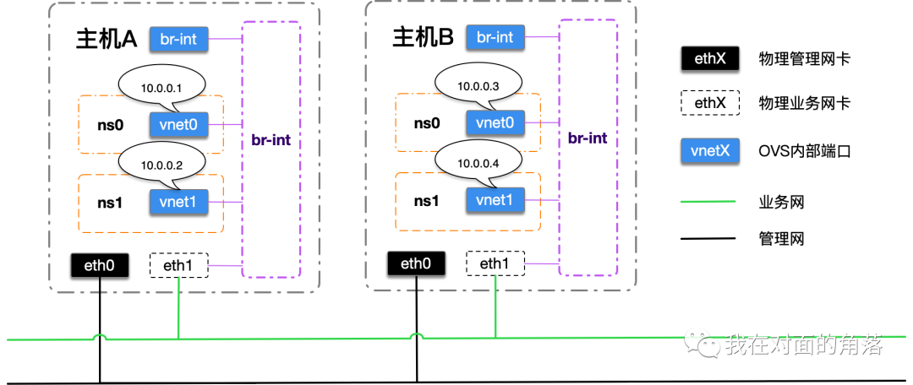
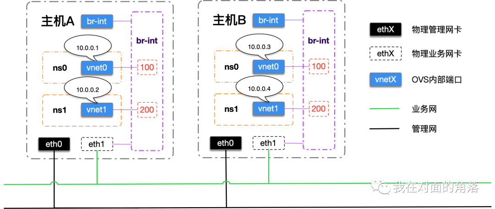

# 跨主机通信 Open vSwitch 动手实验

Open vSwitch 是一个高阶版的 Linux Bridge，提供了更加丰富的功能，例如网络隔离。

[维基百科](https://en.wikipedia.org/wiki/Open_vSwitch)

## 实验环境

*注意，请在虚拟机内折腾，以免干扰工作环境。*

| Node | OS | 用户 | 主机网卡 | 主机 IP |
| :---- | :---- | :---- | :---- | :---- |
| Node-1 | Ubuntu 22.04 | root | ens33 / ens37 | 192.168.245.168 / 192.168.245.169 |
| Node-2 | Ubuntu 22.04 | root | ens33 / ens37 | 192.168.245.172 / 192.168.245.173 |

### 安装依赖

打开 WMware 软件，给虚拟机添加新的网络设备，然后分别在 Node-1 和 Node-2 上执行：

*需要注意的是，如果是使用物理环境搭建网络拓扑，需要把业务网卡对应的交换机端口配置为 trunk 模式。如果是使用 VMWare 搭建网络拓扑，业务网卡需要配置网络类型为仅主机模式。*

```bash
# 在 Node-1 上
root@ubuntu:~# ip addr add 192.168.245.169/24 dev ens37
root@ubuntu:~# ip link set ens37 up

# 在 Node-2 上
root@ubuntu:~# ip addr add 192.168.245.173/24 dev ens37
root@ubuntu:~# ip link set ens37 up
```

安装 Open vSwitch 依赖：

```bash
# 在 Node-1 上
root@ubuntu:~# apt install openvswitch-switch -y
root@ubuntu:~# systemctl start openvswitch-switch

# 在 Node-2 上
root@ubuntu:~# apt install openvswitch-switch -y
root@ubuntu:~# systemctl start openvswitch-switch
```

## 动手实验

### 场景一：无隔离网络



1. 在 Node-1 上操作：

```bash
# 创建 br0 网桥
ovs-vsctl add-br br0

# 将 ens37 网卡以端口的方式，添加到 br0 网桥中
ovs-vsctl add-port br0 ens37

# 添加两个内部端口
ovs-vsctl add-port br0 vnet0 -- set Interface vnet0 type=internal
ovs-vsctl add-port br0 vnet1 -- set Interface vnet1 type=internal

# 创建 docker1 和 docker2 容器
ip netns add docker1
ip netns add docker2

# 将 br0 网桥内部端口分别移动到 docker1 和 docker2 容器中
ip link set vnet0 netns docker1
ip link set vnet1 netns docker2

# 启动端口并配置 IP
ip netns exec docker1 ip link set lo up
ip netns exec docker1 ip link set vnet0 up
ip netns exec docker1 ip addr add 10.0.0.1/24 dev vnet0

ip netns exec docker2 ip link set lo up
ip netns exec docker2 ip link set vnet1 up
ip netns exec docker2 ip addr add 10.0.0.2/24 dev vnet1

# 查看 br0 网桥
ovs-vsctl show
  Bridge br0
    Port ens37
      Interface ens37
        type: internal
    Port vnet0
      Interface vnet0
        type: internal
    Port vnet1
      Interface vnet1
        type: internal
    Port br0
      Interface br0
        type: internal
```

2. 在 Node-2 上操作：

```bash
# 创建 br0 网桥
ovs-vsctl add-br br0

# 将 ens37 网卡以端口的方式，添加到 br0 网桥中
ovs-vsctl add-port br0 ens37

# 添加两个内部端口
ovs-vsctl add-port br0 vnet0 -- set Interface vnet0 type=internal
ovs-vsctl add-port br0 vnet1 -- set Interface vnet1 type=internal

# 创建 docker3 和 docker4 容器
ip netns add docker3
ip netns add docker4

# 将 br0 网桥内部端口分别移动到 docker3 和 docker4 容器中
ip link set vnet0 netns docker3
ip link set vnet1 netns docker4

# 启动端口并配置 IP
ip netns exec docker3 ip link set lo up
ip netns exec docker3 ip link set vnet0 up
ip netns exec docker3 ip addr add 10.0.0.3/24 dev vnet0

ip netns exec docker4 ip link set lo up
ip netns exec docker4 ip link set vnet1 up
ip netns exec docker4 ip addr add 10.0.0.4/24 dev vnet1

# 查看 br0 网桥
ovs-vsctl show
  Bridge br0
    Port ens37
      Interface ens37
        type: internal
    Port vnet0
      Interface vnet0
        type: internal
    Port vnet1
      Interface vnet1
        type: internal
    Port br0
      Interface br0
        type: internal
```

3. 连通性测试

在 Node-1 上：

```bash
ip netns exec docker1 ping 10.0.0.3
ip netns exec docker1 ping 10.0.0.4
ip netns exec docker2 ping 10.0.0.3
ip netns exec docker2 ping 10.0.0.4
```

在 Node-2 上：

```bash
ip netns exec docker3 ping 10.0.0.1
ip netns exec docker3 ping 10.0.0.2
ip netns exec docker4 ping 10.0.0.1
ip netns exec docker4 ping 10.0.0.2
```

测试结果：

| Node-1 | Node-2 | ping 结果 |
| :---- | :---- | :---- |
| docker1 | docker3 | ✅ |
| docker1 | docker4 | ✅ |
| docker2 | docker3 | ✅ |
| docker2 | docker4 | ✅ |

### 场景二：分布式隔离网络

构建分布式隔离网络和单节点的操作方法一致，即给对应的端口配置 VLAN tag。如下图所示，我们分别给主机 A、B 上的端口配置 VLAN tag为 100 和 200。



1. 在 Node-1 上操作：

```bash
ovs-vsctl set Port vnet0 tag=100
ovs-vsctl set Port vnet1 tag=200
```

2. 在 Node-2 上操作：

```bash
ovs-vsctl set Port vnet0 tag=100
ovs-vsctl set Port vnet1 tag=200
```

3. 连通性测试

在 Node-1 上：

```bash
ip netns exec docker1 ping 10.0.0.3
ip netns exec docker1 ping 10.0.0.4
ip netns exec docker2 ping 10.0.0.3
ip netns exec docker2 ping 10.0.0.4
```

在 Node-2 上：

```bash
ip netns exec docker3 ping 10.0.0.1
ip netns exec docker3 ping 10.0.0.2
ip netns exec docker4 ping 10.0.0.1
ip netns exec docker4 ping 10.0.0.2
```

测试结果：

| Node-1 | Node-2 | ping 结果 |
| :---- | :---- | :---- |
| docker1 | docker3 | ✅ |
| docker1 | docker4 | ❌ |
| docker2 | docker3 | ❌ |
| docker2 | docker4 | ✅ |

*参考资料：*

[Open vSwitch 入门实践（3）使用 OVS 构建分布式隔离网络](https://mp.weixin.qq.com/s/2fxjU8DF1XLBctcXqrbcJw)
