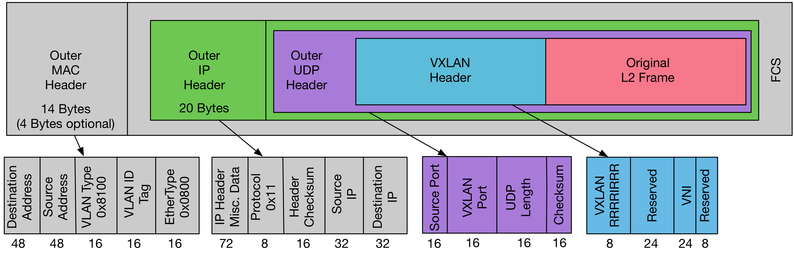

# 跨主机通信 Overlay 网络动手实验

- [跨主机通信 Overlay 网络动手实验](#跨主机通信-overlay-网络动手实验)
  - [实验目的](#实验目的)
  - [实验环境](#实验环境)
    - [安装依赖](#安装依赖)
  - [动手实验](#动手实验)
  - [总结](#总结)

容器跨主机通信一般采用**封包模式**、**路由模式**，Flannel 项目使用 VXLAN 协议实现了 Overlay 网络，VXLAN 协议是一种封包技术，将二层数据包封装成 UDP 数据包，在外层的网络协议栈中进行传输。实现 VXLAN 协议的设备是 VTEP（VXLAN Tunnel Endpoint），即在宿主机之间通过 VTEP 设备建立“隧道”，在其中传输虚拟二层网络包。



Flannel 项目中，VXLAN UDP 数据包内部封装了出入容器的二层数据包，外面加上一个 VXLAN header，VXLAN header 包含 VNI（VXLAN network identifier）字段，用来识别目标 VXLAN 设备。在 VXLAN header 外面封装了一个正常的 UDP 包。Flannel 项目使用 VXLAN 协议，在 UDP 之上实现了一个虚拟的二层网络，连接在这个虚拟网络的容器，就像连接在普通局域网上一样，可以互相通信。

> **封包模式：** 利用 Overlay 网络协议在节点间建立“隧道”，容器之间的网络包被封装在外层的网络协议包中进行传输。
>
> **路由模式：** 容器间的网络包传输全部用三层网络的路由转发来实现。

> Flannel 项目有两种方式实现了封包模式，分别是 VXLAN 协议和 UDP 封包。其中 UDP 是在用户态（Flanneld 进程）封装 UDP 数据包，VXLAN 在内核态封装 UDP 数据包。由于减少了用户态到内核态的切换，封包解包逻辑都在内核态进行，VXLAN 的性能更好，成为了 Overlay 容器网络的主流方案。

## 实验目的

掌握容器网络跨主机通信原理，理解 VXLAN 协议和 Overlay 网络工作原理。

## 实验环境

*注意，请在虚拟机内折腾，以免干扰工作环境。*

| Node | OS | 用户 | 主机网卡 | 主机 IP | 容器 CIDR |
| :---- | :---- | :---- | :---- | :---- | :---- |
| Node-1 | Ubuntu 22.04 | root | ens33 | 192.168.245.168 | 172.17.0.0/24 |
| Node-2 | Ubuntu 22.04 | root | ens33 | 192.168.245.172 | 172.18.0.0/24 |

### 安装依赖

分别在 Node-1 和 Node-2 上执行以下命令安装依赖：

```bash
apt update
apt install bridge-utils
```

## 动手实验

1. 分别在 Node-1 和 Node-2 完成[《单节点容器网络动手实验》](./单节点容器网络实验.md)的[场景一：容器间的网络互通](./单节点容器网络实验.md#场景一容器间的网络互通)章节。
   
*注意：Node-1 容器 CIDR 地址是 172.17.0.0/24，Node-2 容器 CIDR 地址是 172.18.0.0/24。*

在 Node-1 上执行：

```bash
sysctl net.ipv4.conf.all.forwarding=1
ip netns add docker1
ip link add veth0 type veth peer name veth1
ip link set veth0 netns docker1
brctl addbr br0
brctl addif br0 veth1
ip netns exec docker1 ip addr add 172.17.0.2/24 dev veth0
ip netns exec docker1 ip link set veth0 up
ip link set veth1 up
ip addr add 172.17.0.1/24 dev br0
ip link set br0 up
ip netns exec docker1 route add default gw 172.17.0.1 veth0
```

在 Node-2 上执行：

```bash
sysctl net.ipv4.conf.all.forwarding=1
ip netns add docker2
ip link add veth0 type veth peer name veth1
ip link set veth0 netns docker2
brctl addbr br0
brctl addif br0 veth1
ip netns exec docker2 ip addr add 172.18.0.2/24 dev veth0
ip netns exec docker2 ip link set veth0 up
ip link set veth1 up
ip addr add 172.18.0.1/24 dev br0
ip link set br0 up
ip netns exec docker2 route add default gw 172.18.0.1 veth0
```

2. 创建 VXLAN 虚拟网卡：

在 Node-1 创建 vxlan100：

```bash
ip link add vxlan100 type vxlan \
    id 100 \
    local 192.168.245.168 \
    dev ens33 \
    dstport 4789 \
    nolearning
```

为 vxlan100 分配 IP 地址，然后激活：

```bash
ip addr add 172.17.0.0/32 dev vxlan100
ip link set vxlan100 up
```

为了让 Node-1 上访问（Node-2 的容器）172.18.0.0/24 网段的数据包能进入“隧道”，我们需要增加如下的路由规则：

```bash
ip route add 172.18.0.0/24 dev vxlan100
```

查看 Node-1 路由表：

```bash
route -n
Kernel IP routing table
Destination     Gateway         Genmask         Flags Metric Ref    Use Iface
172.18.0.0      0.0.0.0         255.255.255.0   U     0      0        0 vxlan100
```

显然，所有访问 172.18.0.0/24 网段的数据包都会通过 vxlan100 进入“隧道”。而 172.18.0.0/24 网段是 Node-2 容器的 CIDR 地址。

在 Node-2 创建 vxlan100：

```bash
ip link add vxlan100 type vxlan \
    id 100 \
    local 192.168.245.172 \
    dev ens33 \
    dstport 4789 \
    nolearning
```

为 vxlan100 分配 IP 地址，然后激活：

```bash
ip addr add 172.18.0.0/32 dev vxlan100
ip link set vxlan100 up
```

为了让 Node-2 上访问（Node-1 的容器）172.17.0.0/24 网段的数据包能进入“隧道”，我们需要增加如下的路由规则：

```bash
ip route add 172.17.0.0/24 dev vxlan100
```

查看 Node-1 路由表：

```bash
route -n
Kernel IP routing table
Destination     Gateway         Genmask         Flags Metric Ref    Use Iface
172.17.0.0      0.0.0.0         255.255.255.0   U     0      0        0 vxlan100
```

显然，所有访问 172.17.0.0/24 网段的数据包都会通过 vxlan100 进入“隧道”。而 172.17.0.0/24 网段是 Node-1 容器的 CIDR 地址。

3. 手动更新 ARP 和 FDB

TODO: 补充 ARP 和 FDB 相关的知识点。

查看 Node-1 vxlan100 设备的 MAC 地址：

```bash
ip link show vxlan100
7: vxlan100: <BROADCAST,MULTICAST,UP,LOWER_UP> mtu 1450 qdisc noqueue state UNKNOWN mode DEFAULT group default qlen 1000
    link/ether f6:35:84:38:60:f1 brd ff:ff:ff:ff:ff:ff
```

查看 Node-2 vxlan100 设备的 MAC 地址：

```bash
ip link show vxlan100
6: vxlan100: <BROADCAST,MULTICAST,UP,LOWER_UP> mtu 1450 qdisc noqueue state UNKNOWN mode DEFAULT group default qlen 1000
    link/ether 16:8f:3f:90:b9:2e brd ff:ff:ff:ff:ff:ff
```

在 Node-1 上增加 Node-2 的 ARP 和 FDB 的记录：

```bash
ip neighbor add 172.18.0.2 lladdr 16:8f:3f:90:b9:2e dev vxlan100
bridge fdb append 16:8f:3f:90:b9:2e dev vxlan100 dst 192.168.245.172
```

这两条命令的作用是：当 Node-1 上的 docker1 容器访问 Node-2 上的 docker2（172.18.0.2）容器时，vxlan100 会使用 ARP 协议去查询对应容器所在节点上容器 IP 地址对应的 vxlan100 网卡的 MAC 地址，然后填充在 VXLAN 内层的网络包中。

查看执行结果：

```bash
arp -n
Address                  HWtype  HWaddress           Flags Mask            Iface
172.18.0.2               ether   16:8f:3f:90:b9:2e   CM                    vxlan100

bridge fdb
16:8f:3f:90:b9:2e dev vxlan100 dst 192.168.245.172 self permanent
```

在 Node-2 上增加 Node-1 的 ARP 和 FDB 的记录：

```bash
ip neighbor add 172.17.0.2 lladdr f6:35:84:38:60:f1 dev vxlan100
bridge fdb append f6:35:84:38:60:f1 dev vxlan100 dst 192.168.245.168
```

查看执行结果：

```bash
arp -n
Address                  HWtype  HWaddress           Flags Mask            Iface
172.17.0.2               ether   f6:35:84:38:60:f1   CM                    vxlan100

bridge fdb
f6:35:84:38:60:f1 dev vxlan100 dst 192.168.245.168 self permanent
```

4. 测试容器的跨节点通信

Node-1 docker1 访问 Node-2 docker2，在 Node-1 上执行：

```bash
ip netns exec docker1 ping -c 3 172.18.0.2
PING 172.18.0.2 (172.18.0.2) 56(84) bytes of data.
64 bytes from 172.18.0.2: icmp_seq=1 ttl=62 time=1.64 ms
64 bytes from 172.18.0.2: icmp_seq=2 ttl=62 time=1.13 ms
```

Node-2 docker2 访问 Node-1 docker1，在 Node-2 上执行：

```bash
ip netns exec docker2 ping -c 3 172.17.0.2
PING 172.17.0.2 (172.17.0.2) 56(84) bytes of data.
64 bytes from 172.17.0.2: icmp_seq=1 ttl=62 time=0.543 ms
64 bytes from 172.17.0.2: icmp_seq=2 ttl=62 time=1.39 ms
```

显然，docker1 容器和 docker2 容器跨主机通信成功了，这里没有问题。

然后使用 tcpdump 分别抓 docker1 容器内的 veth 虚拟网卡、vxlan100、br0 网桥、宿主机 ens33 网卡的数据包：

```bash
# tcpdump: docker1 容器内的 veth 虚拟网卡
ip netns exec docker1 tcpdump -i veth0 -n
tcpdump: verbose output suppressed, use -v[v]... for full protocol decode
listening on veth0, link-type EN10MB (Ethernet), snapshot length 262144 bytes
08:20:08.536932 IP 172.18.0.2 > 172.17.0.2: ICMP echo request, id 12441, seq 1, length 64
08:20:08.536954 IP 172.17.0.2 > 172.18.0.2: ICMP echo reply, id 12441, seq 1, length 64

# tcpdump: br0 网桥
tcpdump -i br0 -n
tcpdump: verbose output suppressed, use -v[v]... for full protocol decode
listening on br0, link-type EN10MB (Ethernet), snapshot length 262144 bytes
08:21:12.690023 IP 172.18.0.2 > 172.17.0.2: ICMP echo request, id 12933, seq 1, length 64
08:21:12.690050 IP 172.17.0.2 > 172.18.0.2: ICMP echo reply, id 12933, seq 1, length 64

# tcpdump: vxlan100
tcpdump -i vxlan100 -n
tcpdump: verbose output suppressed, use -v[v]... for full protocol decode
listening on vxlan100, link-type EN10MB (Ethernet), snapshot length 262144 bytes
08:23:37.213161 IP 172.18.0.2 > 172.17.0.2: ICMP echo request, id 45282, seq 1, length 64
08:23:37.213232 IP 172.17.0.2 > 172.18.0.2: ICMP echo reply, id 45282, seq 1, length 64

# tcpdump: ens33 宿主机网卡
tcpdump -i ens33 -n | grep 192.168.245.172
tcpdump: verbose output suppressed, use -v[v]... for full protocol decode
listening on ens33, link-type EN10MB (Ethernet), snapshot length 262144 bytes
08:22:08.360508 IP 192.168.245.172.55174 > 192.168.245.168.4789: VXLAN, flags [I] (0x08), vni 100
08:22:08.360594 IP 192.168.245.168.36657 > 192.168.245.172.4789: VXLAN, flags [I] (0x08), vni 100
```

通过 tcpdump 分别监听：docker1 容器内的 veth 虚拟网卡、vxlan100、br0 网桥、ens33 宿主机网卡。

发现 docker1 容器的 veth 虚拟网卡、vxlan100、br0 网桥，数据包的源地址和目的地址分别是 docker1 容器 veth 虚拟网卡的 IP 和 docker2 容器 veth 虚拟网卡的 IP。所以验证上文中的这句话：“Flannel 项目使用 VXLAN 协议，在 UDP 之上实现了一个虚拟的二层网络，连接在这个虚拟网络的容器，就像连接在普通局域网上一样，可以互相通信。”

ens33 宿主机网卡，数据包的源地址和目的地址分别是 Node-1 ens33 网卡的 IP 和 Node-2 ens33 网卡的 IP。并且通过 tcpdump 看到，这是一个携带 VXLAN header 的数据包，VNI 等于 100，也就是上文中创建的 vxlan100 的 ID。所以验证了上文中的这句话：“Flannel 项目使用 VXLAN 协议实现了 Overlay 网络，VXLAN 协议是一种封包技术，将二层数据包封装成 UDP 数据包，在外层的网络协议栈中进行传输。实现 VXLAN 协议的设备是 VTEP（VXLAN Tunnel Endpoint），即在宿主机之间通过 VTEP 设备建立“隧道”，在其中传输虚拟二层网络包。”

## 总结

通过学习了 VXLAN 协议，亲自动手模拟出了 Flannel 项目 VXLAN 封包模式的 Overlay 网络模型，并分别测试了从 Node-1 docker1 容器（172.17.0.0/24）访问 Node-2 docker2 容器（172.18.0.0/24）等场景的网络互通。理解了 VXLAN 设备拆封容器二层数据包的过程。

**参考资料：**

*[极客时间 - Kubernetes 容器网络](https://time.geekbang.org/column/intro/100015201?utm_campaign=geektime_search&utm_content=geektime_search&utm_medium=geektime_search&utm_source=geektime_search&utm_term=geektime_search&tab=catalog)*
