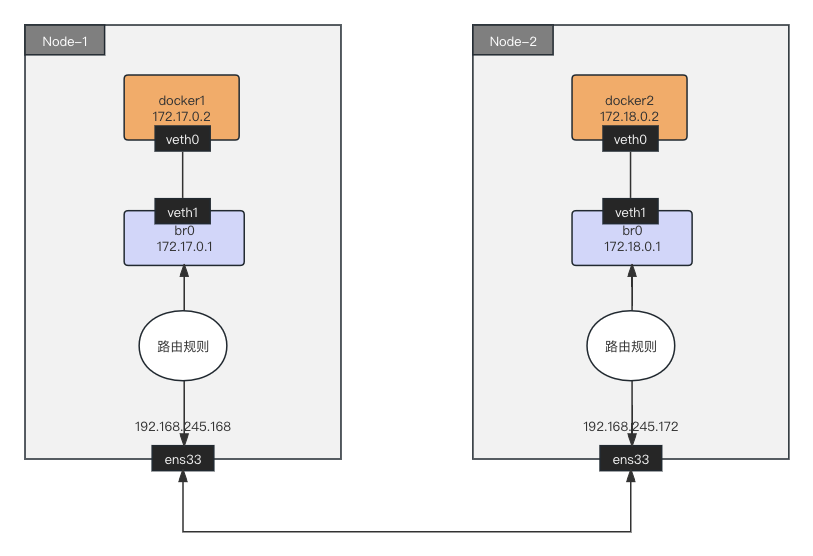

- [跨主机通信路由模式动手实验](#跨主机通信路由模式动手实验)
  - [实验目的](#实验目的)
  - [实验环境](#实验环境)
    - [安装依赖](#安装依赖)
  - [动手实验](#动手实验)
  - [总结](#总结)

# 跨主机通信路由模式动手实验

本文会在多个节点上实验路由模式的网络模型，揭示 flannel 和 calico 项目路由模式的实现原理。

我们按照下图创建网络拓扑，让 Node-1 和 Node-2 的之间的容器网络互通。



路由模式的工作原理，是将每个容器的子网（比如 172.17.0.0/24）的下一跳，设置成了该子网对应的宿主机的 IP 地址（192.168.245.172）。每个节点根据其它节点的宿主机 IP 和容器子网 IP 关系，配置本机路由表。这样对于容器间跨节点的 IP 包，就可以根据本机路由表获得到达目的容器的网关地址，即目的容器所在的宿主机 IP 地址。接着在把 IP 包封装成二层网络数据帧时，将目的 MAC 地址设置为网关的 MAC 地址，IP 包就可以通过二层网络送达目的容器所在的宿主机。这正是 Calico 路由模式和 Flannel host-gw 模式的工作原理。

## 实验目的

掌握 Calico 和 Flannel host-gw 路由模式工作原理。

## 实验环境

*注意，请在虚拟机内折腾，以免干扰工作环境。*

| Node | OS | 用户 | 主机网卡 | 主机 IP | 容器网段 |
| :---- | :---- | :---- | :---- | :---- | :---- |
| Node-1 | Ubuntu 22.04 | root | ens33 | 192.168.245.168 | 172.17.0.0/24 |
| Node-2 | Ubuntu 22.04 | root | ens33 | 192.168.245.172 | 172.18.0.0/24 |

### 安装依赖

分别在 Node-1 和 Node-2 上执行以下命令安装依赖：

```bash
apt update
apt install bridge-utils
```

## 动手实验

1. 分别在 Node-1 和 Node-2 完成[《单节点容器网络动手实验》](./单节点容器网络动手实验.md)的[场景一：容器间的网络互通](./单节点容器网络动手实验.md#场景一容器间的网络互通)章节。

   *注意：Node-1 容器网段地址是 172.17.0.0/24，Node-2 容器网段地址是 172.18.0.0/24。*

   在 Node-1 上执行：

   ```bash
   sysctl net.ipv4.conf.all.forwarding=1
   ip netns add docker1
   ip link add veth0 type veth peer name veth1
   ip link set veth0 netns docker1
   brctl addbr br0
   brctl addif br0 veth1
   ip netns exec docker1 ip addr add 172.17.0.2/24 dev veth0
   ip netns exec docker1 ip link set veth0 up
   ip link set veth1 up
   ip addr add 172.17.0.1/24 dev br0
   ip link set br0 up
   ip netns exec docker1 route add default gw 172.17.0.1 veth0
   ```

   在 Node-2 上执行：

   ```bash
   sysctl net.ipv4.conf.all.forwarding=1
   ip netns add docker2
   ip link add veth0 type veth peer name veth1
   ip link set veth0 netns docker2
   brctl addbr br0
   brctl addif br0 veth1
   ip netns exec docker2 ip addr add 172.18.0.2/24 dev veth0
   ip netns exec docker2 ip link set veth0 up
   ip link set veth1 up
   ip addr add 172.18.0.1/24 dev br0
   ip link set br0 up
   ip netns exec docker2 route add default gw 172.18.0.1 veth0
   ```

2. 在 Node-1 上增加 Node-2 容器网段与 Node-2 主机间关系的路由规则：

   ```bash
   ip route add 172.18.0.0/24 via 192.168.245.172
   ```

   查看 Node-1 主机的 IP 路由表：

   ```bash
   ip route
   172.17.0.0/24 dev br0 proto kernel scope link src 172.17.0.1
   172.18.0.0/24 via 192.168.245.172 dev ens33
   ```

   目的 IP 地址属于 172.18.0.0/24 网段的 IP 包，应该经过本机的 ens33 设备发出去（即：dev ens33）；并且，它下一跳地址是 192.168.245.172（即：via 192.168.245.172）。

3. 在 Node-2 上增加 Node-1 容器网段与 Node-1 主机间关系的路由规则：

   ```bash
   ip route add 172.17.0.0/24 via 192.168.245.168
   ```

   查看 Node-2 主机的 IP 路由表：

   ```bash
   ip route
   172.18.0.0/24 dev br0 proto kernel scope link src 172.18.0.1
   172.17.0.0/24 via 192.168.245.168 dev ens33
   ```

   目的 IP 地址属于 172.17.0.0/24 网段的 IP 包，应该经过本机的 ens33 设备发出去（即：dev ens33）；并且，它下一跳地址是 192.168.245.168（即：via 192.168.245.168）。

   > 当 docker2 访问 docker1 时，IP 包会从 veth 到达 br0，然后根据 Node-2 `172.17.0.0/24 via 192.168.245.168 dev ens33` 路由规则，它的下一跳地址是 Node-1 主机的 IP 地址（192.168.245.168）。这样，IP 包就能路由到 Node-1 了。

4. 测试容器的跨节点通信

   Node-1 docker1 访问 Node-2 docker2，在 Node-1 上执行：

   ```bash
   ip netns exec docker1 ping -c 3 172.18.0.2
   PING 172.18.0.2 (172.18.0.2) 56(84) bytes of data.
   64 bytes from 172.18.0.2: icmp_seq=1 ttl=62 time=1.47 ms
   64 bytes from 172.18.0.2: icmp_seq=2 ttl=62 time=0.930 ms
   ```

   Node-2 docker2 访问 Node-1 docker1，在 Node-2 上执行：

   ```bash
   ip netns exec docker2 ping -c 3 172.17.0.2
   PING 172.17.0.2 (172.17.0.2) 56(84) bytes of data.
   64 bytes from 172.17.0.2: icmp_seq=1 ttl=62 time=0.715 ms
   64 bytes from 172.17.0.2: icmp_seq=2 ttl=62 time=0.627 ms
   ```

   显然，docker1 容器和 docker2 容器跨主机通信成功了。

   然后使用 tcpdump 分别抓 docker1 容器内的 veth 虚拟网卡、br0 网桥、宿主机 ens33 网卡的数据包：

   ```bash
   # tcpdump: docker1 容器内的 veth 虚拟网卡
   ip netns exec docker1 tcpdump -i veth0 -n
   tcpdump: verbose output suppressed, use -v[v]... for full protocol decode
   listening on veth0, link-type EN10MB (Ethernet), snapshot length 262144 bytes
   06:53:48.825645 IP 172.17.0.2 > 172.18.0.2: ICMP echo request, id 19229, seq 1, length 64
   06:53:48.826304 IP 172.18.0.2 > 172.17.0.2: ICMP echo reply, id 19229, seq 1, length 64

   # tcpdump: br0 网桥
   tcpdump -i br0 -n
   tcpdump: verbose output suppressed, use -v[v]... for full protocol decode
   listening on br0, link-type EN10MB (Ethernet), snapshot length 262144 bytes
   06:54:30.206146 IP 172.17.0.2 > 172.18.0.2: ICMP echo request, id 9097, seq 1, length 64
   06:54:30.206784 IP 172.18.0.2 > 172.17.0.2: ICMP echo reply, id 9097, seq 1, length 64

   # tcpdump: ens33 宿主机网卡
   tcpdump src 172.17.0.2 -v
   tcpdump: listening on ens33, link-type EN10MB (Ethernet), snapshot length 262144 bytes
   07:08:17.298935 IP (tos 0x0, ttl 63, id 23180, offset 0, flags [DF], proto ICMP (1), length 84)
       172.17.0.2 > 172.18.0.2: ICMP echo request, id 37943, seq 1, length 64
   07:08:18.300797 IP (tos 0x0, ttl 63, id 23226, offset 0, flags [DF], proto ICMP (1), length 84)
       172.17.0.2 > 172.18.0.2: ICMP echo request, id 37943, seq 2, length 64
   ```

   通过 tcpdump 分别监听：docker1 容器内的 veth 虚拟网卡、br0 网桥、ens33 宿主机网卡。

   发现 docker1 容器的 veth 虚拟网卡、br0 网桥，数据包的源地址和目的地址分别是 docker1 容器 veth 虚拟网卡的 IP 和 docker2 容器 veth 虚拟网卡的 IP。

   ens33 宿主机网卡，数据包的源 IP 和目的 IP 也是 docker1 容器 veth 虚拟网卡的 IP 和 docker2 容器 veth 虚拟网卡的 IP。仔细发现 IP 数据包的 TTL 等于 63（Linux 中 IP 数据包 TTL 默认等于 64），显然这个 IP 数据包经过了一个路由设备，这正是 `ip route add 172.18.0.0/24 via 192.168.245.172` 路由规则生效了。

## 总结

**路由模式**的工作原理非常简单，只需要设置容器网段 IP 数据包的下一跳地址为目标 Node 主机 IP 即可。

**封包模式**对基础设施要求低，三层网络通就可以了。但封包、拆包带来的性能损耗较大。

> Flannel VXLAN、Calico IPIP 模式的网络性能损耗 20% ~ 30%。

**路由模式**要求二层网络连通，网络性损耗小。但不适用 Node 跨网段的场景。

> 比如上海机房和北京机房 Node 之间通过三层路由进行转发。

**参考资料：**

*[极客时间 - Kubernetes 容器网络](https://time.geekbang.org/column/intro/100015201?utm_campaign=geektime_search&utm_content=geektime_search&utm_medium=geektime_search&utm_source=geektime_search&utm_term=geektime_search&tab=catalog)*
