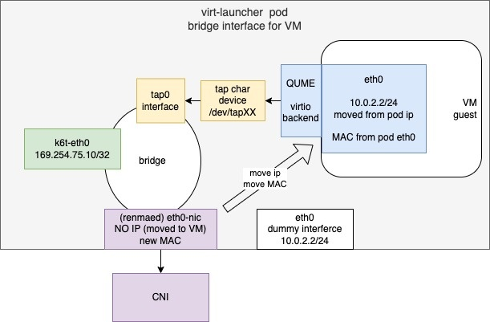

# Kubevirt Bridge + ovs 网络动手实验

在 bridge 模式下，虚拟机通过 Linux Bridge、连接到 QEMU virtio 设备。Pod 网络 IPv4 地址通过 DHCPv4 委派给虚拟机。虚拟机应配置为使用 DHCP 获取 IPv4 地址（Pod 的 IP 和 MAC 地址被移动到 KubeVirt 虚拟机内部，所以 Pod 网卡就没有 IP 和 MAC 地址了）。



## 动手实验

1. 完成[跨主机通信 Open vSwitch 动手实验](/kubernetes/network/跨主机通信openvswitch动手实验.md)

2. 使用 `bridge.yaml` 创建虚拟机：

```yaml
apiVersion: kubevirt.io/v1
kind: VirtualMachine
metadata:
  name: bridge-ovs
spec:
  dataVolumeTemplates:
  - metadata:
      name: systemdisk-bridge-ovs
    spec:
      pvc:
        accessModes:
        - ReadWriteOnce
        resources:
          requests:
            storage: 10Gi
        storageClassName: local-path
      source:
        registry:
          url: docker://release-ci.daocloud.io/virtnest/system-images/centos-7.9-x86_64:v1
  runStrategy: Always
  template:
    metadata:
      annotations:
        ipam.spidernet.io/ippools: '[{"interface":"eth0","ipv4":["vlan40-v4"]}]'
    spec:
      architecture: amd64
      domain:
        cpu:
          cores: 1
          model: host-model
          sockets: 2
          threads: 1
        devices:
          disks:
          - disk:
              bus: virtio
            name: systemdisk-bridge-ovs
          - disk:
              bus: virtio
            name: cloudinitdisk
          interfaces:
          - bridge: {}
            name: ovs-bridge1
          - bridge: {}
            name: ovs-bridge2
        features:
          acpi:
            enabled: true
        machine:
          type: q35
        resources:
          requests:
            memory: 1Gi
      networks:
      - multus:
          default: true
          networkName: kube-system/ovs-vlan30
        name: ovs-bridge1
      - multus:
          networkName: kube-system/ovs-vlan40
        name: ovs-bridge2
      volumes:
      - dataVolume:
          name: systemdisk-bridge-ovs
        name: systemdisk-bridge-ovs
      - cloudInitNoCloud:
          networkData: |
            version: 2
            ethernets:
              enp1s0:
                dhcp4: true
              enp2s0:
                dhcp4: true
          userData: |
            #cloud-config
            ssh_pwauth: true
            disable_root: false
            chpasswd: {"list": "root:dangerous", expire: False}
            runcmd:
              - sed -i "/#\?PermitRootLogin/s/^.*$/PermitRootLogin yes/g" /etc/ssh/sshd_config 
        name: cloudinitdisk
```

TODO: 正在补充
