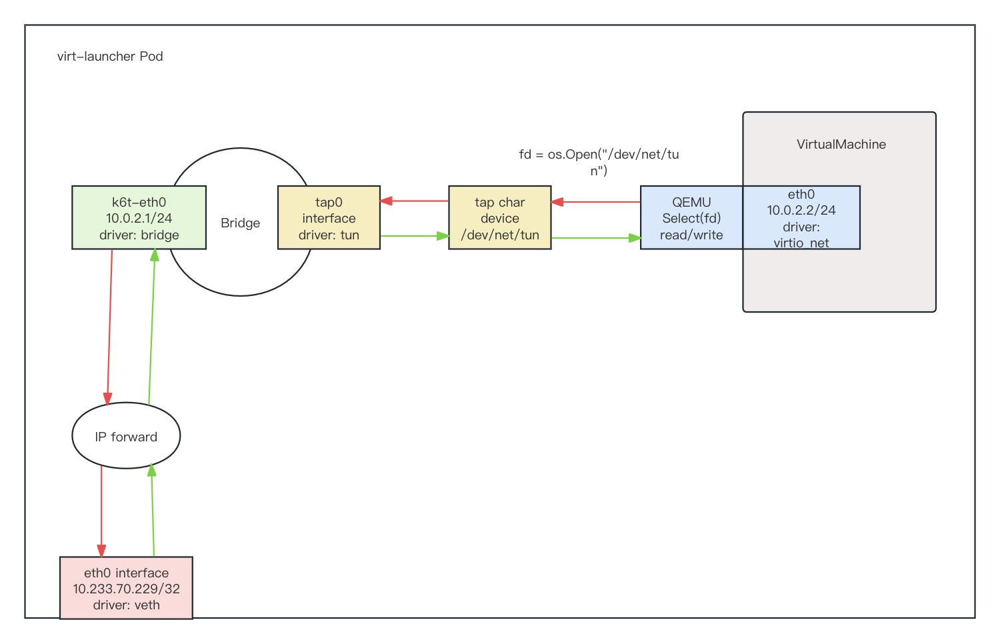

# KubeVrit + Masquerade 动手实验

在 masquerade 模式下，KubeVirt 为虚拟机分配内部 IP 地址，并将其隐藏在 NAT 后面。所有离开虚拟机的流量都使用 Pod IP 地址进行 SNAT。因此，集群内的工作负载应该使用 Pod 的 IP 地址连接虚拟机。该 IP 地址在 VMI 的 `spec.status.interface` 中定义。虚拟机操作系统应该配置为使用 DHCP 获取 IPv4 地址。

为了允许虚拟机实时迁移或硬重启（两者都会导致虚拟机运行在不同的 Pod 上，使用不同的 IP 地址）并且仍然可以访问，它应该由 Kubernetes 的 Service 公开。

下图是 masquerade 模式下虚拟机与集群内工作负载通信的示意图：



## 实验目的

掌握虚拟机 masquerade 网络通信原理，提高虚拟机网络排障的基本能力。

## 实验环境

| Node | 用户 | 主机网卡 | 主机 IP | K8s 版本 | CNI 插件 | CSI 插件 | KubeVirt 版本 |
| :---- | :---- | :---- | :---- | :---- | :---- | :---- | :---- |
| master | root | ens192 | 10.7.120.1 | v1.23.10 | Calico | rancher.io/local-path | v1.0.0 |

## 动手实验

1. 使用 `masquerade.yaml` 创建虚拟机：

```yaml
apiVersion: kubevirt.io/v1
kind: VirtualMachine
metadata:
  name: masquerade
spec:
  dataVolumeTemplates:
  - metadata:
      name: masquerade
    spec:
      pvc:
        accessModes:
        - ReadWriteOnce
        resources:
          requests:
            storage: 10Gi
        storageClassName: local-path
      source:
        registry:
          url: docker://release-ci.daocloud.io/virtnest/system-images/centos-7.9-x86_64:v1
  runStrategy: Always
  template:
    spec:
      architecture: amd64
      domain:
        cpu:
          cores: 1
          model: host-model
          sockets: 2
          threads: 1
        devices:
          disks:
          - disk:
              bus: virtio
            name: masquerade
          - disk:
              bus: virtio
            name: cloudinitdisk
          interfaces:
          - masquerade: {}
            name: default
        features:
          acpi:
            enabled: true
        machine:
          type: q35
        resources:
          requests:
            memory: 1Gi
      networks:
      - name: default
        pod: {}
      volumes:
      - dataVolume:
          name: masquerade
        name: masquerade
      - cloudInitNoCloud:
          userData: |
            #cloud-config
            ssh_pwauth: true
            disable_root: false
            chpasswd: {"list": "root:dangerous", expire: False}
            runcmd:
              - sed -i "/#\?PermitRootLogin/s/^.*$/PermitRootLogin yes/g" /etc/ssh/sshd_config
        name: cloudinitdisk
```

2. 查看虚拟机 Pod IP 与 VMI IP 是否一致：

```bash
kubectl get pod virt-launcher-masquerade-vs8dz -o wide
NAME                             READY   STATUS    RESTARTS   AGE   IP             NODE     NOMINATED NODE   READINESS GATES
virt-launcher-masquerade-vs8dz   1/1     Running   0          20h   10.233.70.50   master   <none>           1/1

kubectl get vmi masquerade
NAME         AGE   PHASE     IP             NODENAME   READY
masquerade   20h   Running   10.233.70.50   master     True
```

3. 进入 `virt-launcher-masquerade-vs8dz` Pod 的网络命名空间：

如果你采用 docker 作为容器的运行时，那么请执行如下命令（containerd 用户请跳过这一步）：

```bash
ln -s /var/run/docker/netns /var/run/netns
```

*这里没有找到合适的方法判断 `virt-launcher-masquerade-vs8dz` Pod 所在的 Network Namespace 名字，所以使用 `ls /var/run/netns` 命令，通过 Pod 创建的时间确定。*

```bash
ls -l /var/run/docker/netns
-r--r--r-- 1 root root 0 12月 11 04:24 d89a919c644c
```

进入 `virt-launcher-masquerade-vs8dz` Pod 所在的 Network Namespace：

```bash
ip netns exec d89a919c644c sh
```

使用 `ip a` 命令，查看 Pod 网络命名空间中的网络设备和路由表：

```bash
4: eth0@if693: <BROADCAST,MULTICAST,UP,LOWER_UP> mtu 1480 qdisc noqueue state UP group default
    link/ether 36:d1:34:c5:1b:ae brd ff:ff:ff:ff:ff:ff link-netnsid 0
    inet 10.233.70.229/32 scope global eth0
       valid_lft forever preferred_lft forever
5: k6t-eth0: <BROADCAST,MULTICAST,UP,LOWER_UP> mtu 1480 qdisc noqueue state UP group default
    link/ether 02:00:00:00:00:00 brd ff:ff:ff:ff:ff:ff
    inet 10.0.2.1/24 brd 10.0.2.255 scope global k6t-eth0
       valid_lft forever preferred_lft forever
6: tap0: <BROADCAST,MULTICAST,UP,LOWER_UP> mtu 1480 qdisc pfifo_fast master k6t-eth0 state UP group default qlen 1000
    link/ether e6:1e:91:8f:0d:b4 brd ff:ff:ff:ff:ff:ff
```

显然，根据[单节点容器网络实验](/kubernetes/network/单节点容器网络实验.md)可知，eht0 是 veth pairs 设备，可以使用 `ethtool -i eth0` 查看：

```bash
sh-4.2# ethtool -i eth0
driver: veth
version: 1.0
```

tap0 设备是 tun 设备，可以使用 `ethtool -i tap0` 命令查看：

> TUN/TAP 设备的原理是，在 Linux 内核中添加了一个 TUN/TAP 虚拟网络设备的驱动程序和一个与之相关连的字符设备 /dev/net/tun，字符设备 tun 作为用户空间和内核空间交换数据的接口。当内核将数据包发送到虚拟网络设备时，数据包被保存在设备相关的一个队列中，直到用户空间程序通过打开的字符设备 tun 的描述符读取时，它才会被拷贝到用户空间的缓冲区中，其效果就相当于，数据包直接发送到了用户空间。通过系统调用 write 发送数据包时其原理与此类似。

```bash
sh-4.2# ethtool -i tap0
driver: tun
version: 1.6
```

k6t-eth0 设备是一个虚拟网桥，使用 `ethtool -i k6t-eth0` 命令查看：

```bash
sh-4.2# ethtool -i k6t-eth0
driver: bridge
version: 2.3
```

通过 `brctl show k6t-eth0` 命令，查看插在 k6t-eth0 网桥上的网卡和路由表：

```bash
sh-4.2# brctl show k6t-eth0
bridge name	bridge id		STP enabled	interfaces
k6t-eth0		8000.020000000000	no		tap0

sh-4.2# route -n
Kernel IP routing table
Destination     Gateway         Genmask         Flags Metric Ref    Use Iface
0.0.0.0         169.254.1.1     0.0.0.0         UG    0      0        0 eth0
10.0.2.0        0.0.0.0         255.255.255.0   U     0      0        0 k6t-eth0
```

显然，tap0 网卡已经插在 k6t-eth0 网桥上，并且 10.0.2.0/24 网段的数据包都会进入 k6t-eth0 网桥。这里没有任何问题。

所以，所有从 Pod 发往 VirtualMachine（10.0.2.0/24）的数据包都会进入 k6t-eth0 网桥，而网桥上的 tap0 设备的 `/dev/net/tun` 驱动程序，会负责把数据拷贝到用户空间的缓冲区中，然后 QEMU 程序会 read("/dev/net/tun") 这个文件，从中取出数据包，并且发送到 virtio_net 设备上。

> virtio_net 设备是 QEMU 程序模拟出来的一个网卡设备，它接收 tap0 设备发来的数据包，它被添加在 VirtualMachine 中。下文会介绍这个设备。

4. 使用 virtctl 或者 ssh 登录虚拟机：

```bash
virtctl console masquerade
# ssh root@10.233.70.50
```

使用 `ip a` 命令，查看虚拟机中的网络设备和路由表：

```bash
[root@masquerade ~]# ip a
2: eth0: <BROADCAST,MULTICAST,UP,LOWER_UP> mtu 1480 qdisc pfifo_fast state UP group default qlen 1000
    link/ether 52:54:00:7b:2a:1a brd ff:ff:ff:ff:ff:ff
    inet 10.0.2.2/24 brd 10.0.2.255 scope global dynamic eth0
       valid_lft 86230793sec preferred_lft 86230793sec
    inet6 fe80::5054:ff:fe7b:2a1a/64 scope link
       valid_lft forever preferred_lft forever

[root@masquerade ~]# route -n
Kernel IP routing table
Destination     Gateway         Genmask         Flags Metric Ref    Use Iface
0.0.0.0         10.0.2.1        0.0.0.0         UG    0      0        0 eth0
10.0.2.0        0.0.0.0         255.255.255.0   U     0      0        0 eth0
```

eth0 设备是 virtio_net 设备，可以使用 `ethtool -i eth0` 命令查看：

```bash
[root@masquerade ~]# ethtool -i eth0
driver: virtio_net
version: 1.0.0
```

所有从虚拟机出去的数据包，都会进入到 eth0（virtio_net）设备。virtio_net 设备是 QEMU 程序模拟出来的一个网卡设备，负责接收来自宿主机（Pod）tap0 设备发来的数据包。最终，数据包会进入虚拟机的网络协议栈中。这里没有任何问题。

5. 测试虚拟机与外部网络通信：

在虚拟机内，`ping 153.3.238.102`（这个是 baidu 的 IP 地址），并且使用 tcpdump 分别抓 virt-launcher Pod 的 eth0、k6t-eth0、tap0 设备，虚拟机 eth0 设备的数据包，master 节点主机的 ens192 设备。

```bash
# 在虚拟机上 ping 153.3.238.102
[root@hjm-masquerade ~]# ping 153.3.238.102 -w 200 > /dev/null &
[2] 9861

# tcpdump: 虚拟机 eth0
[root@hjm-masquerade ~]# tcpdump -i eth0 -n
[85485.202566] device eth0 entered promiscuous mode
tcpdump: verbose output suppressed, use -v or -vv for full protocol decode
listening on eth0, link-type EN10MB (Ethernet), capture size 262144 bytes
09:19:12.406266 IP 10.0.2.2 > 153.3.238.102: ICMP echo request, id 9861, seq 4, length 64
09:19:12.414201 IP 153.3.238.102 > 10.0.2.2: ICMP echo reply, id 9861, seq 4, length 64

# tcpdump: virt-launcher tap0
sh-4.2# tcpdump -i tap0 -n
tcpdump: verbose output suppressed, use -v or -vv for full protocol decode
listening on tap0, link-type EN10MB (Ethernet), capture size 262144 bytes
04:23:07.759741 IP 10.0.2.2 > 153.3.238.102: ICMP echo request, id 9864, seq 1, length 64
04:23:07.767116 IP 153.3.238.102 > 10.0.2.2: ICMP echo reply, id 9864, seq 1, length 64

# tcpdump: virt-launcher k6t-eth0
sh-4.2# tcpdump -i k6t-eth0 -n
tcpdump: verbose output suppressed, use -v or -vv for full protocol decode
listening on k6t-eth0, link-type EN10MB (Ethernet), capture size 262144 bytes
04:23:59.472005 IP 10.0.2.2 > 153.3.238.102: ICMP echo request, id 9865, seq 1, length 64
04:23:59.479422 IP 153.3.238.102 > 10.0.2.2: ICMP echo reply, id 9865, seq 1, length 64

# tcpdump: virt-launcher eth0
sh-4.2# tcpdump -i eth0 -n
tcpdump: verbose output suppressed, use -v or -vv for full protocol decode
listening on eth0, link-type EN10MB (Ethernet), capture size 262144 bytes
04:24:23.137110 IP 10.233.70.50 > 153.3.238.102: ICMP echo request, id 9866, seq 1, length 64
04:24:23.144406 IP 153.3.238.102 > 10.233.70.50: ICMP echo reply, id 9866, seq 1, length 64

# tcpdump: master 节点 ens192
[root@master ~]# tcpdump -i ens192 -n | grep 153.3.238.102
tcpdump: verbose output suppressed, use -v or -vv for full protocol decode
listening on ens192, link-type EN10MB (Ethernet), capture size 262144 bytes
20:50:04.864368 IP 10.7.120.1 > 153.3.238.102: ICMP echo request, id 33435, seq 1, length 64
20:50:04.872932 IP 153.3.238.102 > 10.7.120.1: ICMP echo reply, id 33435, seq 1, length 64
```

通过 tcpdump 分别监听：virt-launcher Pod 的 eth0、k6t-eth0、tap0 设备，以及虚拟机 eth0 设备的数据包。

发现虚拟机的 eth0 网卡、virt-launcher Pod 的 tap0、k6t-eth0 设备，数据包的源地址和目的地址分别是虚拟机（10.0.2.2/32）和 baidu（153.3.238.102）的 IP。

virt-launcher Pod 的 eth0 网卡，数据包的源地址和目的地址分别是 Pod eth0 网卡的 IP（10.233.70.50/32）和 baidu（153.3.238.102）的 IP。

查看 virt-launcher Pod 的 iptables 规则：

> TODO: virt-launcher 没有 iptables 命令

*virt-launcher Pod 内，应该有一条类似的 MASQUERADE 链规则：*

```bash
[root@10-6-8-1 ~]# iptables -t nat -L POSTROUTING -n -v
Chain POSTROUTING (policy ACCEPT 241 packets, 14460 bytes)
 pkts bytes target     prot opt in     out     source               destination
    2   168 MASQUERADE  all  --  *      !docker0  172.17.0.0/16        0.0.0.0/0
```

这条规则的作用是：当数据包的源地址为 10.0.2.0/24 网段（虚拟机的 IP），出口设备不是 k6t-eth0 时（不是虚拟交换机），就执行 MASQUERADE 动作。MASQUERADE 是一种源地址转换动作，它会动态选择宿主机的一个 IP 做源地址转换，而 SNAT 动作必须在命令中指定固定的 IP 地址。

> 因为虚拟机的 IP 地址外部并不认识（外部指的是宿主机连接在公网的路由器），如果它要访问外网，需要在数据包离开前将源地址替换为宿主机的 IP，这样外部主机才能用宿主机的 IP 作为目的地址发回响应。

master 节点的 ens192 网卡，数据包的源地址和目的地址分别是 master 节点的 ens192 网卡的 IP（10.7.120.1）和 baidu（153.3.238.102）的 IP。

查看 master 节点 的 iptables 规则：

```bash
[root@master ~]# iptables -t nat -vnL
Chain POSTROUTING (policy ACCEPT 145 packets, 8716 bytes)
 pkts bytes target     prot opt in     out     source               destination
7859K  472M cali-POSTROUTING  all  --  *      *       0.0.0.0/0            0.0.0.0/0            /* cali:O3lYWMrLQYEMJtB5 */
<...>
Chain cali-POSTROUTING (1 references)
 pkts bytes target     prot opt in     out     source               destination
  41M 2477M cali-fip-snat  all  --  *      *       0.0.0.0/0            0.0.0.0/0            /* cali:Z-c7XtVd2Bq7s_hA */
  41M 2477M cali-nat-outgoing  all  --  *      *       0.0.0.0/0            0.0.0.0/0            /* cali:nYKhEzDlr11Jccal */
    0     0 MASQUERADE  all  --  *      tunl0   0.0.0.0/0            0.0.0.0/0            /* cali:SXWvdsbh4Mw7wOln */ ADDRTYPE match src-type !LOCAL limit-out ADDRTYPE match src-type LOCAL
<...>
Chain cali-nat-outgoing (1 references)
 pkts bytes target     prot opt in     out     source               destination
  18M 1056M MASQUERADE  all  --  *      *       0.0.0.0/0            0.0.0.0/0            /* cali:flqWnvo8yq4ULQLa */ match-set cali40masq-ipam-pools src ! match-set cali40all-ipam-pools dst

# DNAT
[root@master ~]# iptables -t nat -vnL
Chain PREROUTING (policy ACCEPT 646 packets, 22600 bytes)
 pkts bytes target     prot opt in     out     source               destination
  23M 1282M cali-PREROUTING  all  --  *      *       0.0.0.0/0            0.0.0.0/0            /* cali:6gwbT8clXdHdC1b1 */
<...>
Chain cali-PREROUTING (1 references)
 pkts bytes target     prot opt in     out     source               destination
  23M 1282M cali-fip-dnat  all  --  *      *       0.0.0.0/0            0.0.0.0/0            /* cali:r6XmIziWUJsdOK6Z */
```

cali-POSTROUTING 链插入到 POSTROUTING 链的顶部，在该链 cali-nat-outgoin 内，对源自 cali40all-ipam-pools 的所有出口流量进行 SNAT。cali-PREROUTING 链同理，对入口流量进行 DNAT。[查看官方文档](https://www.tkng.io/cni/calico/#snat-functionality)

> 因为 Pod 的 IP 地址外部并不认识（外部指的是宿主机连接在公网的路由器），如果它要访问外网，需要在数据包离开前将源地址替换为宿主机 ens192 的 IP，这样外部主机才能用宿主机 ens192 的 IP 作为目的地址发回响应。

## 总结

通过部署 masquerade 网络模式的 KubeVirt 虚拟机，然后通过 tcpdump 工具监听并且分析了虚拟机内部与外部网络通信所经过的所有设备。发现虚拟机出口 Pod 的流量进行 masquerade；Pod 出口外部网络的流量进行 masquerade；外部网络进入 Pod 的流量进行 DNAT；Pod 进入虚拟机的流量首先经过 k6t-eth0 网桥，并且进行 DNAT 到虚拟机（10.0.2.2）。掌握了 masquerade 网络模式虚拟机网络排障的基本能力。
