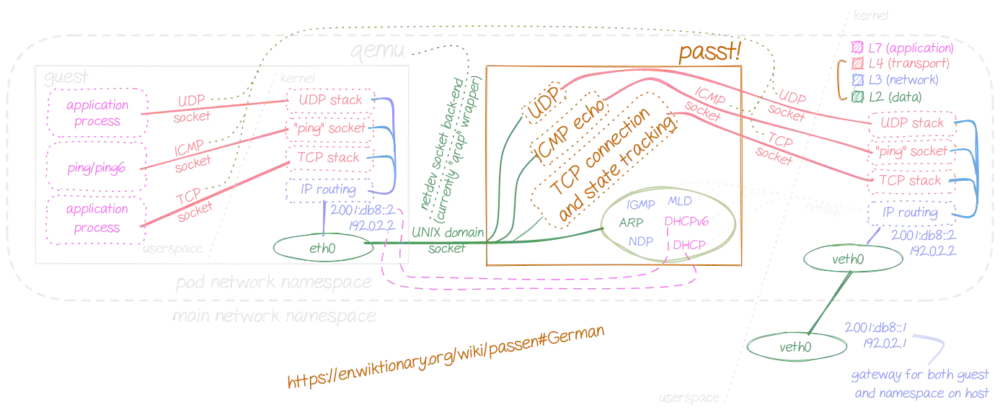

# Kubevirt Passt + macvlan 网络动手实验

passt（Plug A Simple Socket Transport）是一个实现了二层网络接口与宿主机本地四层网络 Socket（TCP、UDP、ICMP/ICMPv6 回显）之间转换的翻译层。将宿主机的四层网络翻译成 KubeVirt 虚拟机能够识别的二层网络，然后通过 UNIX Domain Socket 与 KubeVirt 虚拟机的 eth0（virtio_net）网卡通信。

Unix domain socket 又叫 IPC（inter-process communication 进程间通信）socket，用于实现同一主机上的进程间通信。socket 原本是为网络通讯设计的，但后来在 socket 的框架上发展出一种 IPC 机制，就是 UNIX domain socket。不需要经过网络协议栈，不需要打包拆包、计算校验和、维护序号和应答等，只是将应用层数据从一个进程拷贝到另一个进程。这是因为，IPC 机制本质上是可靠的通讯，而网络协议是为不可靠的通讯设计的。

官方文档：<https://passt.top/passt/about>

下图是 Pod veth 网卡、passt 进程、KubeVirt 虚拟机之间通信的原理图：



## 实验目的

掌握 macvlan + KubeVirt Passt 网络模式，虚拟机网络通信工作原理，提高 KubeVirt + macvlan 部署模式下，网络排障的基本能力。

## 实验环境

| Node | 用户 | 主机网卡 | 主机 IP | K8s 版本 | CNI 插件 | CSI 插件 | KubeVirt 版本 |
| :---- | :---- | :---- | :---- | :---- | :---- | :---- | :---- |
| master | root | ens192 | 10.7.120.1/16 | v1.23.10 | Calico | rancher.io/local-path | v1.0.0 |

## 动手实验

1. 完成[跨主机通信 macvlan 动手实验](/kubernetes/network/跨主机通信macvlan动手实验.md)

2. 使用 `passt.yaml` 创建虚拟机：

```yaml
apiVersion: kubevirt.io/v1
kind: VirtualMachine
metadata:
  name: passt-macvlan
spec:
  dataVolumeTemplates:
  - metadata:
      name: systemdisk-passt-macvlan
    spec:
      pvc:
        accessModes:
        - ReadWriteOnce
        resources:
          requests:
            storage: 10Gi
        storageClassName: local-path
      source:
        registry:
          url: docker://release-ci.daocloud.io/virtnest/system-images/centos-7.9-x86_64:v1
  runStrategy: Always
  template:
    spec:
      architecture: amd64
      domain:
        cpu:
          cores: 1
          model: host-model
          sockets: 2
          threads: 1
        devices:
          disks:
          - disk:
              bus: virtio
            name: systemdisk-passt-macvlan
          - disk:
              bus: virtio
            name: cloudinitdisk
          interfaces:
          - passt: {}
            name: default
        features:
          acpi:
            enabled: true
        machine:
          type: q35
        resources:
          requests:
            memory: 1Gi
      networks:
      - name: default
        pod: {}
      volumes:
      - dataVolume:
          name: systemdisk-passt-macvlan
        name: systemdisk-passt-macvlan
      - cloudInitNoCloud:
          userData: |
            #cloud-config
            ssh_pwauth: true
            disable_root: false
            chpasswd: {"list": "root:dangerous", expire: False}
            runcmd:
              - sed -i "/#\?PermitRootLogin/s/^.*$/PermitRootLogin yes/g" /etc/ssh/sshd_config 
        name: cloudinitdisk
```

3. 查看虚拟机 Pod IP 与 VMI IP：

```bash
[root@master network]# k get pod -o wide
NAME                                READY   STATUS    RESTARTS   AGE   IP             NODE     NOMINATED NODE   READINESS GATES
virt-launcher-passt-macvlan-q8gp6   1/1     Running   0          59s   10.233.70.4    master   <none>           1/1
[root@master network]# k get vmi
NAME            AGE     PHASE     IP             NODENAME   READY
passt-macvlan   2m20s   Running   10.233.70.4    master     True
```

虽然，Pod IP 和 VMI 的 IP 看起来完全一致，但是它们是两个完全不同的网络。这里没有任何问题。并且，10.233.70.4/24 这个 IP 并不是 Node ens192 子网 macvlan 的 IP。这是因为此集群采用 Calico CNI 插件，默认情况下使用的是 Overlay 网络，这里没有问题。

不过这并不影响我们的实验。

4. 进入 `virt-launcher-passt-macvlan` Pod：

```bash
kubectl exec -it virt-launcher-passt-macvlan bash

# 使用 top 命令，查看 passt 进程
bash-5.1$ top
top - 06:20:50 up 45 days, 18:08,  0 users,  load average: 20.67, 19.13, 19.18

  PID USER      PR  NI    VIRT    RES    SHR S  %CPU  %MEM     TIME+ COMMAND
   49 qemu      20   0   85588  41372   1024 S   0.0   0.3   0:01.07 passt.avx2

# 使用 passt 命令，查看网络配置信息
bash-5.1$ passt.avx2
No external routable interface for IPv6
Outbound interface (IPv4): macvlan1
MAC:
    host: 36:03:73:60:a4:70
DHCP:
    assign: 10.7.120.202
    mask: 255.255.0.0
    router: 10.7.0.1
DNS:
    169.254.25.10
DNS search list:
    default.svc.cluster.local
    svc.cluster.local
    cluster.local

# 使用 passt 命令，查看帮助信息
bash-5.1$ passt.avx2 -h
  -s, --socket PATH	UNIX domain socket path
    default: probe free path starting from /tmp/passt_1.socket
  <...>
```

可以看到 `passt.avx2` 命令输出了 virt-launcher Pod macvlan1 网卡的信息，其中 MAC 和 IP 地址与 macvlan1 网卡的配置一致。这里没有问题。

`passt.avx2 -h` 命令输出了丰富的 passt 命令的帮助信息，其中 `--socket` 参数是 UNIX domain socket 的路径，默认从 `/tmp/passt_1.socket` 读取，可以使用 `ls /tmp/ | grep passt` 命令查看。

5. 删除 `virt-launcher-passt-macvlan` Pod 的 eth0 网卡：

*这里没有找到合适的方法判断 `virt-launcher-passt-macvlan` Pod 所在的 Network Namespace 名字，所以使用 `ls /var/run/netns` 命令，通过 Pod 创建的时间确定。*

```bash
ls -l /var/run/docker/netns
-r--r--r-- 1 root root 0 12月 13 20:51 75ba4216ee82
```

进入 75ba4216ee82 Network Namespace：

```bash
ip netns exec 75ba4216ee82 sh
```

删除 eth0 网卡：

```bash
# 先禁用网卡
sh-4.2# ip link set dev eth0 down
# 删除网卡
sh-4.2# ip link delete eth0
```

6. 创建 macvlan 网络：

```bash
# 在所有节点上执行
ip link add link ens192 dev macvlan1 type macvlan mode vepa
```

7. 将 macvlan 子接口挂到 virt-launcher-passt-macvlan Pod（Network Namespace）中：

```bash
# 在 Node 上执行
ip link set macvlan1 netns 75ba4216ee82
```

8. 进入 75ba4216ee82 Network Namespace，分别配置 IP 地址：

```bash
ip addr add 10.7.120.202/16 dev macvlan1
ip link set macvlan1 up
```

查看网络信息：

```bash
sh-4.2# ip a
817: macvlan1@if2: <BROADCAST,MULTICAST,UP,LOWER_UP> mtu 1500 qdisc noqueue state UP group default qlen 1000
    link/ether 36:03:73:60:a4:70 brd ff:ff:ff:ff:ff:ff link-netnsid 0
    inet 10.7.120.202/16 scope global macvlan1
       valid_lft forever preferred_lft forever
```

显然，已经为 virt-launcher-passt-macvlan Pod 分配了一个主网卡为 Node ens192，子网卡为 macvlan1 的 IP 地址。

> 通过 macvlan1@if2 可以看到，macvlan1 子网卡是 Node 的第 2 个网卡，也就是 ens192 网卡。

*注意，Node ens192 的 IP 是 10.7.120.1/16，配置的子接口 IP 也必须是同一网段的。这里我将 macvlan1 子接口 IP 配置为 10.7.120.202/16。*

9. 为 virt-launcher-passt-macvlan Pod（Network Namespace）配置默认路由：

```bash
# 在 75ba4216ee82 Network Namespace 内执行
sh-4.2# ip route add default via 10.7.0.1 dev macvlan1
```

查看路由信息：

```bash
sh-4.2# route -n
Kernel IP routing table
Destination     Gateway         Genmask         Flags Metric Ref    Use Iface
0.0.0.0         10.7.0.1        0.0.0.0         UG    0      0        0 macvlan1
```

10. 测试网络连通性（virt-launcher-passt-macvlan Pod 端）：

在任意一台连接了 10.7.0.0/16 网段的机器上执行（当然，在 DaoCloud 局域网内也是可以的）：

```bash
# 在 MAC OS 物理机上（ping virt-launcher-passt-macvlan Pod 的 IP）
➜  ~ ping 10.7.120.202
PING 10.7.120.202 (10.7.120.202): 56 data bytes
64 bytes from 10.7.120.202: icmp_seq=0 ttl=60 time=15.825 ms
```

进入 virt-launcher-passt-macvlan Pod 的 Network Namesapce：

```bash
# tcpdump: macvlan1
sh-4.2# tcpdump -i macvlan1 -n | grep 10.7.120.202
tcpdump: verbose output suppressed, use -v or -vv for full protocol decode
listening on macvlan1, link-type EN10MB (Ethernet), capture size 262144 bytes
21:42:32.807937 IP 10.64.1.46 > 10.7.120.202: ICMP echo request, id 60751, seq 0, length 64
21:42:32.807958 IP 10.7.120.202 > 10.64.1.46: ICMP echo reply, id 60751, seq 0, length 64
```

显然，从 MAC OS 物理机向 10.7.120.202 发送的网络数据包，成功出现在了 virt-launcher-passt-macvlan Pod 网络协议栈中。这里没有任何问题。

11.  测试网络连通性（KubeVirt passt-macvlan 虚拟机端）：

```bash
# 在 MAC OS 物理机上（ssh virt-launcher-passt-macvlan Pod 的 IP）
➜  ~ ssh root@10.7.120.202
root@10.7.120.202's password:
Last login: Thu Dec 14 02:45:33 2023 from 10.64.1.46
[root@passt-macvlan ~]# ip a
1: lo: <LOOPBACK,UP,LOWER_UP> mtu 65536 qdisc noqueue state UNKNOWN group default qlen 1000
    link/loopback 00:00:00:00:00:00 brd 00:00:00:00:00:00
    inet 127.0.0.1/8 scope host lo
       valid_lft forever preferred_lft forever
    inet6 ::1/128 scope host
       valid_lft forever preferred_lft forever
2: eth0: <BROADCAST,MULTICAST,UP,LOWER_UP> mtu 65520 qdisc pfifo_fast state UP group default qlen 1000
    link/ether 52:54:00:12:34:56 brd ff:ff:ff:ff:ff:ff
    inet 10.233.70.4/32 brd 10.233.70.4 scope global eth0
       valid_lft forever preferred_lft forever
    inet6 fe80::5054:ff:fe12:3456/64 scope link
       valid_lft forever preferred_lft forever

# 在 passt-macvlan 虚拟机上 ping MAC OS 物理机
[root@passt-macvlan ~]# ping 10.64.1.46
PING 10.64.1.46 (10.64.1.46) 56(84) bytes of data.
64 bytes from 10.64.1.46: icmp_seq=1 ttl=255 time=8.59 ms
```

显然，MAC OS 物理机与 KubeVirt passt-macvlan 虚拟机网络互相联通了。这里没有任何问题。

## 总结

通过使用 Calico CNI 网络插件，与 KubeVirt Passt 网络模式结合，部署了一台 KubeVirt 虚拟机；然后将这台虚拟机（virt-launcher Pod）的 eth0 网卡删除（删除 Calico CNI 分配的网络和 IP）；然后在 Node ens192 网卡上创建了一个 macvlan 子接口，并且将其挂载到 virt-launcher Pod 的 Network Namespace 中；然后给 virt-launcher Pod 的 macvlan 子接口分配了 IP 并设置了默认路由。并且测试了 macvlan 模式下，virt-launcher Pod、KubeVirt 虚拟机、10.7.0.0/16 网段上的机器（当然，在 DaoCloud 局域网内也是可以的）之间的网络连通性。
